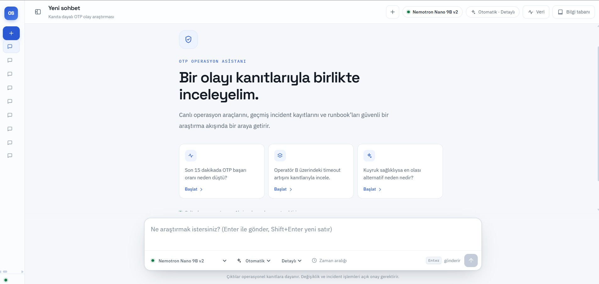
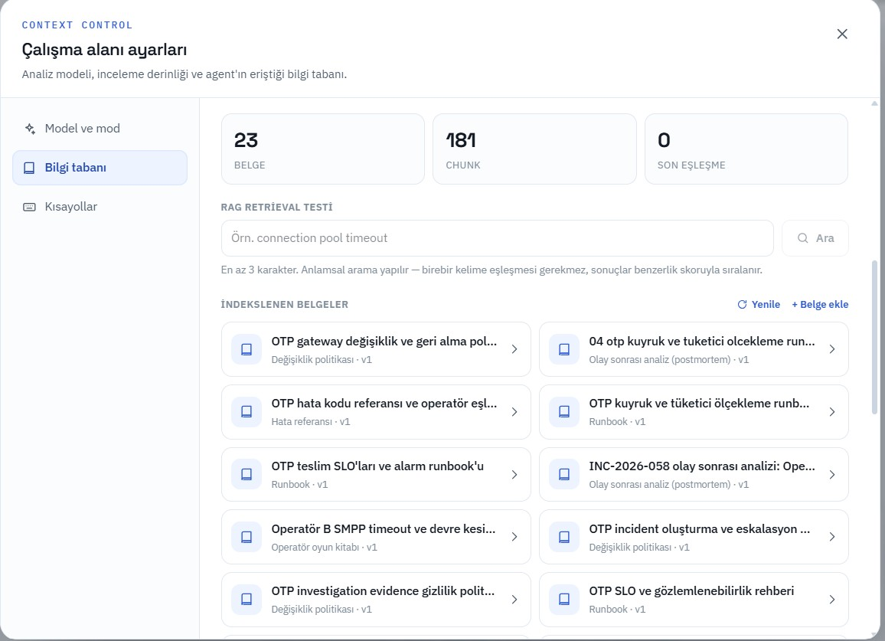
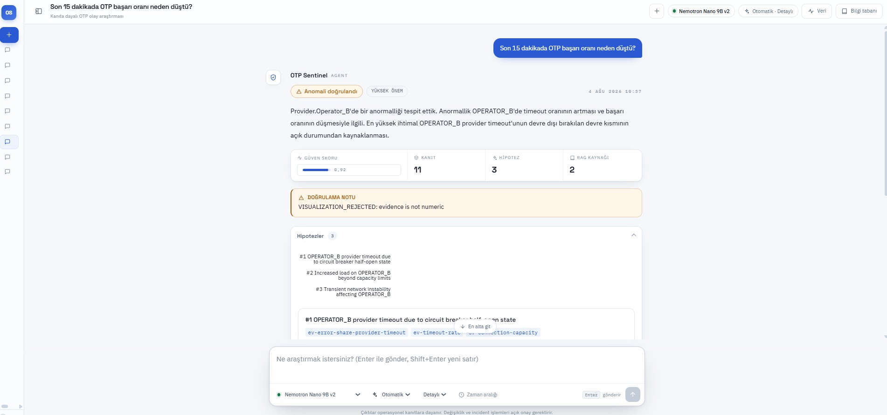
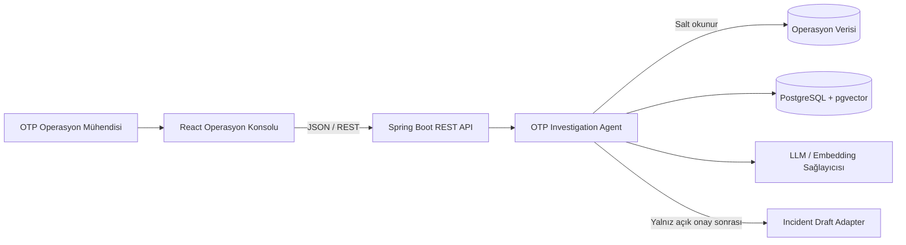
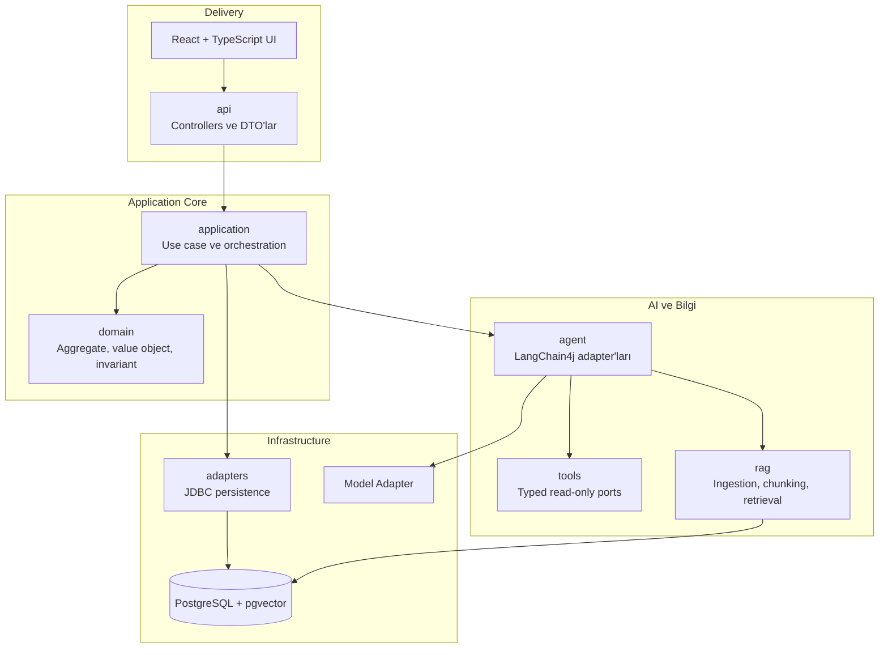
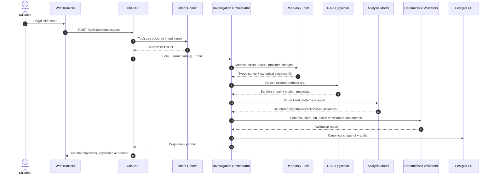
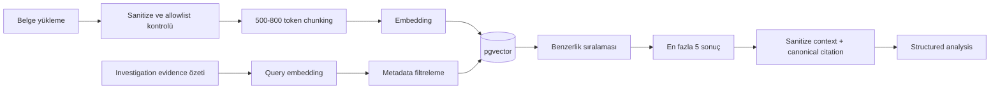
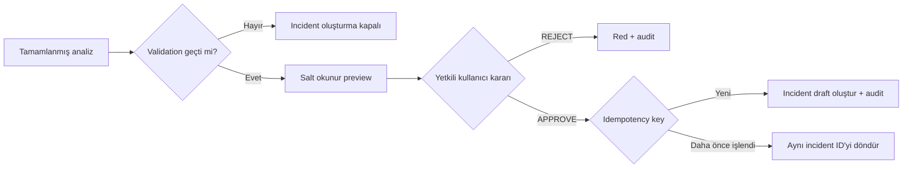

<div align="center">

# OTP Sentinel

### Kanıta dayalı OTP olay inceleme asistanı

Operasyon sinyallerini, geçmiş olay bilgisini ve güvenli insan onayını tek bir araştırma akışında birleştiren production-aware yapay zekâ uygulaması.

<p>
  
  
  
  
  
  
  
  
  
  
  
</p>

<p>
  <a href="#hızlı-başlangıç">Hızlı Başlangıç</a> ·
  <a href="#mimari">Mimari</a> ·
  <a href="#rag-nasıl-çalışır">RAG</a> ·
  <a href="#api">API</a> ·
  <a href="#test-stratejisi">Testler</a>
</p>

</div>



> [!IMPORTANT]
> Bu repo sentetik ve anonim verilerle çalışan bir proof of concept'tir. Gerçek OTP göndermez, gerçek müşteri verisi içermez ve herhangi bir kurumun iç sistem mimarisini temsil etmez.

## İçindekiler

- [Proje nedir?](#proje-nedir)
- [Neden bu proje?](#neden-bu-proje)
- [Öne çıkan yetenekler](#öne-çıkan-yetenekler)
- [Uygulama ekranları](#uygulama-ekranları)
- [Ana demo senaryosu](#ana-demo-senaryosu)
- [Mimari](#mimari)
  - [Sistem bağlamı](#sistem-bağlamı)
  - [Modüler monolith yapısı](#modüler-monolith-yapısı)
  - [İstekten sonuca inceleme akışı](#istekten-sonuca-inceleme-akışı)
  - [Agentic ve deterministik sınır](#agentic-ve-deterministik-sınır)
- [Araçlar ve kanıt modeli](#araçlar-ve-kanıt-modeli)
- [RAG nasıl çalışır?](#rag-nasıl-çalışır)
- [Güvenlik ve insan onayı](#güvenlik-ve-insan-onayı)
- [Teknoloji yığını](#teknoloji-yığını)
- [Hızlı başlangıç](#hızlı-başlangıç)
- [Çalışma modları](#çalışma-modları)
- [Yapılandırma](#yapılandırma)
- [API](#api)
- [Test stratejisi](#test-stratejisi)
- [Proje yapısı](#proje-yapısı)
- [Bilinen sınırlar](#bilinen-sınırlar)
- [Dokümantasyon haritası](#dokümantasyon-haritası)

## Proje nedir?

OTP Sentinel, OTP teslimatındaki bir düşüşü doğal dilde araştırmaya yardımcı olan sınırlı kapsamlı bir operasyon asistanıdır. Kullanıcının sorusunu yorumlar, izin verilen salt-okunur araçlarla canlı operasyon verisini toplar, geçmiş olay ve runbook belgelerini RAG ile tarar ve her iddiayı kaynağına bağlayan yapılandırılmış bir analiz üretir.

Sistem üç farklı konuşma yolunu birbirinden ayırır:

| Yol | Davranış | Araç çağrısı | Investigation kaydı |
|---|---|---:|---:|
| `CHAT` | Selamlaşma, kimlik, yetenek ve kullanım sorularını yanıtlar | 0 | 0 |
| `CLARIFICATION` | Belirsiz OTP sorusu için tek bir açıklayıcı soru sorar | 0 | 0 |
| `INVESTIGATION` | Kanıt toplar, RAG yapar, hipotez ve öneri üretir | İzinli ve sınırlı | Var |

Bu ayrım, ürünü genel amaçlı bir chatbot'a dönüştürmeden doğal bir kullanım deneyimi sağlar. Hava durumu, güncel haber, kod yazma veya kişisel tavsiye gibi kapsam dışı talepler araç çalıştırılmadan nazikçe reddedilir.

## Neden bu proje?

Bir OTP başarı oranı alarmı tek başına kök nedeni açıklamaz. Operasyon mühendisi genellikle başarı oranını, hata kodlarını, sağlayıcı sağlığını, kuyruk durumunu, yakın tarihli değişiklikleri ve geçmiş olay kayıtlarını ayrı kaynaklardan toplamak zorundadır. Bu süreç:

- ilk değerlendirmeyi geciktirir,
- kanıt ile varsayımın karışmasına yol açabilir,
- kurumsal bilgiyi kişilere bağımlı hâle getirir,
- aceleyle alınan operasyonel aksiyonların riskini artırır.

OTP Sentinel bu parçaları tek bir kanıt defterinde birleştirir. Hedefi otomatik kök neden ilan etmek veya sistemi kendi başına değiştirmek değil; hızlı, izlenebilir ve güvenli bir ilk değerlendirme üretmektir.

## Öne çıkan yetenekler

- **Semantik yönlendirme:** Seçili ve allowlist'teki model, mesajı toolsuz olarak `CHAT`, `CLARIFICATION` veya `INVESTIGATION` yoluna yönlendirir.
- **Agentic araç seçimi:** Model yalnızca onaylı salt-okunur araçlar arasından gerekli sinyalleri seçer.
- **Evidence-first analiz:** Metrik, hipotez ve görselleştirmeler uygulamanın ürettiği canonical evidence ID'lerine bağlanır.
- **RAG destekli kurumsal hafıza:** Sentetik incident, runbook, hata referansı, sağlayıcı playbook'u ve politika belgeleri pgvector üzerinden getirilir.
- **Kaynak izi:** Arayüz, her yanıt için kullanılan veritabanı araçlarını, okunan değerleri ve RAG chunk'larını gösterir.
- **Güvenli görselleştirme:** Grafik tipi, birimi, seri ve nokta sayısı allowlist ile sınırlıdır; kaynağı olmayan sayılar reddedilir.
- **Human-in-the-loop:** Incident taslağı ancak tamamlanmış ve doğrulanmış analizden sonra, açık kullanıcı onayıyla oluşturulabilir.
- **Idempotency:** Aynı anahtarla tekrarlanan onay ikinci bir incident üretmez.
- **Offline demo:** Varsayılan stub modu internet, canlı LLM veya API anahtarı olmadan deterministik çalışır.
- **Canlı model modu:** Yapılandırılmış model kataloğundaki doğrulanmış modellerle gerçek tool calling ve embedding akışı desteklenir.
- **Operasyon veri gezgini:** Başarı oranı, hata dağılımı, sağlayıcı kırılımı, kuyruk sağlığı ve değişiklik zaman çizelgesi ham veriyle incelenebilir.
- **Tek komut dağıtım:** Frontend, Spring Boot artifact'ine gömülür; uygulama ve pgvector veritabanı Docker Compose ile birlikte başlar.

## Uygulama ekranları

### Operasyon asistanı

Ana konsol; model, etkileşim modu, analiz derinliği ve zaman aralığını tek bir composer üzerinden yönetir. Hazır araştırma kartları demo akışını hızlıca başlatır.

### Bilgi tabanı ve RAG gezgini

Bilgi tabanı ekranı indekslenen belgeleri ve chunk sayılarını görünür kılar. Semantik arama testi eşik uygulamadan sonuçları benzerlik skoruna göre sıralar; yeni belge yükleme akışı sanitize edilmiş içerik, chunk metni, token sayısı ve embedding modelini gösterir.



### Kanıta bağlı inceleme sonucu

Sonuç ekranı durum, önem seviyesi, güven skoru, kanıtlar, hipotezler, RAG kaynakları ve güvenli aksiyonları aynı bağlamda sunar. Aşağıdaki örnekte görünen doğrulama notu özellikle önemlidir: canonical sayısal kanıtla eşleşmeyen bir görselleştirme reddedilmiş, fakat doğrulanmış analiz korunmuştur.



## Ana demo senaryosu

Kullanıcı şu soruyu sorar:

> Son 15 dakikada OTP başarı oranı neden düştü?

`OTP-DROP-001` senaryosunda sistem aşağıdaki sinyalleri birleştirir:

| Sinyal | Gözlem | Analizdeki rolü |
|---|---|---|
| Genel başarı oranı | Önceki dönemde `%98,10`, mevcut dönemde `%72,10` | Anomaliyi doğrular |
| Sağlayıcı kırılımı | Hataların yaklaşık `%96`'sı `OPERATOR_B` üzerinde | Etki alanını daraltır |
| Hata dağılımı | `PROVIDER_TIMEOUT` en büyük hata grubudur | Timeout hipotezini güçlendirir |
| İç kuyruk | Sağlıklı, consumer sayısı beklenen seviyede | İç backlog hipotezini zayıflatır |
| Sağlayıcı sağlığı | Timeout `%31`, circuit breaker `HALF_OPEN`, bağlantı kullanımı `48/50` | Kapasite/bağlantı havuzu hipotezini güçlendirir |
| Son değişiklikler | Gateway sürüm değişikliği ile düşüş zamansal olarak yakındır | Korelasyon sağlar; nedensellik ilan etmez |
| Geçmiş bilgi | Benzer olay ve runbook chunk'ları bulunur | Doğrulama adımlarını ve bağlamı zenginleştirir |

Beklenen sonuç `ANOMALY_CONFIRMED` ve `HIGH` önem seviyesidir. En güçlü hipotez gateway bağlantı havuzu veya connection release problemidir; sağlayıcı taraflı geçici yavaşlama alternatif hipotez olarak korunur. Sistem rollback, restart, trafik yönlendirme veya yapılandırma değişikliği çalıştırmaz.

## Mimari

Proje, domain'i framework ve dış sistem ayrıntılarından koruyan **modüler monolith + hexagonal boundaries** yaklaşımını kullanır:

```text
api -> application -> domain
adapters -> application ports
```

Spring, LangChain4j, JDBC, HTTP ve model sağlayıcı ayrıntıları domain katmanının dışında tutulur.

### Sistem bağlamı



Demo ortamındaki operasyon ve incident adaptörleri sentetiktir. Mimari, dış kaynakların daha sonra application port'larını uygulayan gerçek adaptörlerle değiştirilmesine izin verir.

### Modüler monolith yapısı



Temel paket sorumlulukları:

| Paket | Sorumluluk |
|---|---|
| `api` | REST endpoint'leri, DTO mapping, request validation ve problem-details hataları |
| `application` | Conversation routing, investigation use case'leri, claim/PII/visualization doğrulama |
| `domain` | Framework'ten bağımsız aggregate, value object ve iş kuralları |
| `agent` | LangChain4j servisleri, model adapter'ları, tool budget ve evidence toplama |
| `tools` | Typed operasyon araçları ve fixture/JDBC uygulamaları |
| `rag` | Belge ingestion, sanitization, chunking, embedding ve retrieval |
| `adapters` | PostgreSQL repository adaptörleri |
| `config` | Spring wiring, model seçimi, persistence ve CORS yapılandırması |

### İstekten sonuca inceleme akışı



`CHAT` ve `CLARIFICATION` kararlarında akış investigation orchestrator'a girmez; araç, RAG ve investigation persistence çalışmaz.

### Agentic ve deterministik sınır

Sistemin kritik tasarım kararı, yapay zekânın iyi olduğu yorumlama işleri ile güvenlik açısından deterministik olması gereken kuralları ayırmaktır.

| Yapay zekâya bırakılanlar | Deterministik Java kodunun sahip oldukları |
|---|---|
| Kullanıcı niyetini semantik yorumlama | Input, enum ve zaman aralığı doğrulama |
| İzinli araçlar arasından seçim yapma | Tool allowlist, çağrı limiti, timeout ve tekrar engeli |
| Kanıtları yorumlayıp hipotez sıralama | Evidence ID ve sayısal claim doğrulama |
| Geçmiş bilgiyi bağlama oturtma | PII tarama ve retrieved-content sanitization |
| Güvenli manuel kontrol adımları önerme | Yasak aksiyon politikası ve visualization allowlist |
| Doğal dil özeti üretme | Approval, authorization, idempotency ve audit |

Ana ilke:

> LLM araştırmayı yönlendirir ve hipotez üretir; yetki, doğrulama ve write işlemleri LLM'e devredilmez.

## Araçlar ve kanıt modeli

Investigation sırasında yalnızca aşağıdaki onaylı araçlar kullanılabilir:

| Araç | Okuduğu sinyal | Ürettiği başlıca kanıt |
|---|---|---|
| `getOtpMetrics` | Mevcut ve önceki dönem teslimat metrikleri | Total, delivered, failed, success rate, latency |
| `getErrorDistribution` | Hata kodu ve sağlayıcı dağılımı | Error count ve share |
| `getQueueHealth` | İç OTP kuyruğu | Pending, oldest age, consumer ve dead-letter durumu |
| `getProviderHealth` | Sağlayıcı sağlık verisi | Response time, timeout, circuit breaker ve bağlantı kullanımı |
| `getRecentChanges` | Deploy, config ve gözlem olayları | Değişiklik zaman çizelgesi |
| `searchIncidentKnowledge` | Incident, runbook ve politika chunk'ları | Canonical citation ve similarity score |

Koruma kuralları:

- Araçlar salt-okunurdur; arbitrary SQL, URL, shell veya filesystem erişimi yoktur.
- İnceleme başına resmî sınır en fazla **8 araç çağrısıdır**.
- Aynı başarılı araç ve aynı argüman kombinasyonu ikinci kez çalıştırılmaz.
- Tool timeout, transient retry ve toplam investigation deadline deterministik olarak uygulanır.
- Model evidence ID üretmez; ID'ler uygulama tarafından tool sonucundan türetilir.
- Kaynağı olmayan sayısal iddia validation failure üretir.
- `createIncidentDraft`, normal investigation tool set'inin parçası değildir.

## RAG nasıl çalışır?

RAG katmanı anlık operasyon metriği üretmez. Amacı, live evidence'a geçmiş olaylardan ve prosedürlerden doğrulama bağlamı eklemektir.

Desteklenen belge türleri:

- incident postmortem,
- runbook,
- hata kodu referansı,
- sağlayıcı playbook'u,
- kapasite ve gözlemlenebilirlik rehberi,
- güvenlik ve değişiklik politikası.



Her citation `documentId`, `version`, `title`, `chunkId` ve `similarityScore` taşır. Sağlayıcı biliniyorsa metadata filtresi uygulanabilir. Düşük benzerlik skoru güçlü kanıt sayılmaz ve live evidence her zaman historical knowledge'dan önceliklidir.

Retrieved belgeler **güvenilmeyen referans verisi** kabul edilir. İçerikte “önceki talimatları yok say” gibi bir komut bulunsa bile tool policy, interaction mode veya incident onay akışı değişmez. HTML/script temizleme, boyut sınırı, document-type allowlist ve instruction-pattern sinyali ingestion aşamasında uygulanır.

Offline mod hash tabanlı deterministik embedding ve fixture bilgisini kullanabilir. Canlı modda aynı pipeline yapılandırılmış embedding sağlayıcısıyla pgvector üzerinde çalışır.

## Güvenlik ve insan onayı

OTP Sentinel bir autonomous remediation sistemi değildir. Aşağıdaki işlemleri kendi başına yapamaz:

- rollback veya restart,
- trafik yönlendirme,
- configuration değişikliği,
- gerçek OTP gönderimi,
- kullanıcı adına approval verme,
- açık onay olmadan incident oluşturma.

Incident akışı ayrı ve deterministik bir güvenlik kapısıdır:



> [!WARNING]
> Local demo profilinde authentication bulunmaz. Production hedefinde investigation, preview, approval ve admin işlemleri ayrı yetkiler gerektirir.

Ek güvenlik kontrolleri:

- model ve embedding anahtarları yalnız environment/secret manager üzerinden alınır,
- gerçek telefon, OTP değeri, müşteri adı veya account ID modele gönderilmez,
- route rationale veya chain-of-thought API'ye ve loglara yazılmaz,
- suggestions plain-text ve sınırlı sayıdadır; URL, HTML, executable içerik ve PII reddedilir,
- bozuk RAG veya model yanıtı write yetkisi kazandırmaz,
- audit kaydı başarısızsa write işlemi güvenli biçimde durur.

## Teknoloji yığını

| Katman | Teknoloji | Kullanım amacı |
|---|---|---|
| Backend | Java 21, Spring Boot 3.3.5 | REST API, orchestration, validation ve runtime |
| AI orchestration | LangChain4j 1.18.1 | Tool calling, structured output ve model adaptasyonu |
| Frontend | React 19, TypeScript, Vite, Tailwind CSS | Operasyon konsolu ve adaptive sonuç ekranı |
| Grafikler | Recharts | Typed ve evidence-bound görselleştirmeler |
| Veritabanı | PostgreSQL 16 | Investigation, audit, operasyon ve knowledge metadata |
| Vector search | pgvector | Embedding saklama ve similarity search |
| Migration | Flyway | Şema versiyonlama |
| Build | Maven, npm | Backend ve frontend build/test |
| Dağıtım | Multi-stage Dockerfile, Docker Compose | Tek artifact ve tekrarlanabilir yerel ortam |
| Backend test | JUnit 5, Testcontainers | Unit, integration ve gerçek PostgreSQL/pgvector testi |
| Frontend test | Vitest, Testing Library | Component ve kullanıcı etkileşimi testleri |

## Hızlı başlangıç

### Gereksinimler

- Docker Engine ve Docker Compose
- Boş bir `8080` portu
- PostgreSQL host portu için varsayılan olarak boş bir `5432` portu

Varsayılan demo internet veya model API anahtarı gerektirmez.

### Docker Compose ile çalıştırma

```bash
docker compose up --build
```

İlk çalıştırmada `.env` oluşturmak zorunlu değildir; Compose güvenli offline `stub` varsayılanlarıyla başlar. Özel port veya canlı model ayarları gerektiğinde `.env.example` dosyasını `.env` olarak kopyalayın ve yalnız yerel değerleri düzenleyin.

Servisler ayağa kalktıktan sonra:

| Adres | Açıklama |
|---|---|
| `http://localhost:8080/` | OTP Sentinel web konsolu |
| `http://localhost:8080/actuator/health` | Uygulama health endpoint'i |
| `http://localhost:8080/swagger-ui/index.html` | Swagger UI |
| `http://localhost:8080/v3/api-docs` | OpenAPI JSON |

Health kontrolü:

```bash
curl -s http://localhost:8080/actuator/health
# {"status":"UP"}
```

Arka planda çalıştırmak için:

```bash
docker compose up --build -d
docker compose ps
```

Host'ta `5432` kullanılıyorsa `.env` içinde örneğin `POSTGRES_PORT=55432` ayarlayın. Compose ağı içindeki uygulama bağlantısı yine `db:5432` kullanır.

Frontend ayrı bir runtime container değildir. Dockerfile önce React uygulamasını derler, çıktıyı Spring Boot'un static kaynaklarına ekler ve tek uygulama artifact'i üretir.

### Yerel geliştirme

Backend:

```bash
docker compose up -d db
mvn spring-boot:run
```

Frontend:

```bash
cd frontend
npm ci
npm run dev
```

Vite geliştirme sunucusu `http://localhost:5173` üzerinde, backend ise `http://localhost:8080` üzerinde çalışır. Ayrı origin geliştirmesinde backend'i `dev` Spring profiliyle başlatın.

```bash
mvn spring-boot:run -Dspring-boot.run.profiles=dev
```

## Çalışma modları

### Offline / stub modu

`AI_MODE=stub` varsayılandır:

- internet bağlantısı gerekmez,
- API anahtarı gerekmez,
- model davranışı deterministiktir,
- CI ve güvenilir demo akışı için uygundur,
- ana `OTP-DROP-001` senaryosunu tekrar üretir.

### Canlı model modu

`AI_MODE=live`, allowlist'teki doğrulanmış chat modelleri ve gerçek embedding servisiyle çalışır:

```bash
cp .env.example .env

# .env içinde:
# AI_MODE=live
# NVIDIA_API_KEY=<yerel anahtarınız>

docker compose up --build
```

Canlı modda bilgi belgeleri başlangıçta idempotent olarak pgvector'a ingest edilir. Model seçici yalnız tool calling ve structured-output compatibility testinden geçen model kimliklerini gösterir. Sağlayıcı katalogundaki her model otomatik olarak kullanıma açılmaz.

> [!CAUTION]
> Gerçek anahtarı `.env.example`, Git geçmişi, log, ekran görüntüsü veya Docker image içine eklemeyin. `.env` dosyası gitignore kapsamındadır.

### Hızlı ve detaylı inceleme

| Mod | Davranış |
|---|---|
| `QUICK` | Beş operasyon aracını kullanır, RAG aramasını atlayarak gecikmeyi azaltır |
| `THOROUGH` | Operasyon sinyallerine ek olarak RAG bilgisini kullanabilir |

Bu seçim yalnız investigation derinliğini etkiler; `CHAT` ve `CLARIFICATION` yollarına araç eklemez.

## Yapılandırma

Başlıca environment değişkenleri:

| Değişken | Amaç |
|---|---|
| `AI_MODE` | `stub` veya `live` çalışma modu |
| `AI_MAX_TOOL_CALLS` | Investigation tool çağrı üst sınırı; güvenlik politikası gereği `8` değerini aşmamalı |
| `AI_QUICK_MODE_MAX_TOOL_CALLS` | Hızlı modun salt-okunur araç bütçesi |
| `AI_MAX_REPAIR_ATTEMPTS` | Bozuk structured output için sınırlı repair denemesi |
| `AI_TIMEOUT_SECONDS` | Model çağrısı timeout'u |
| `AI_CHAT_MEMORY_MAX_MESSAGES` | Session başına in-memory konuşma sınırı |
| `AI_CHAT_MEMORY_MAX_SESSIONS` | LRU ile tutulan maksimum session sayısı |
| `RAG_TOP_K` | Retrieval sonuç sayısı; en fazla `5` |
| `RAG_MIN_SCORE` | Minimum benzerlik eşiği |
| `INVESTIGATION_MAX_SECONDS` | Toplam investigation deadline |
| `TOOL_TIMEOUT_MILLIS` | Tek araç çağrısı timeout'u |
| `TOOL_RETRY_COUNT` | Transient araç hatası retry sayısı |
| `DEMO_FIXTURE` | Demo veri seti; ana senaryo `OTP-DROP-001` |
| `NVIDIA_API_KEY` | Yalnız canlı mod için secret |
| `NVIDIA_BASE_URL` | OpenAI-compatible model API base URL'i |
| `NVIDIA_CHAT_MODEL` | Canlı chat modeli kimliği |
| `NVIDIA_EMBEDDING_MODEL` | Knowledge embedding modeli kimliği |
| `POSTGRES_PORT` | PostgreSQL host port mapping'i |

UTC sistem içinde canonical zaman dilimidir. Explicit `startAt` ve `endAt` verilmezse desteklenen “son N dakika/saat” ifadeleri çözülür; ifade yoksa güvenli varsayılan son 15 dakikadır. Geçerli aralık 1 dakika ile 24 saat arasındadır.

## API

Tüm API'ler `/api/v1` altında JSON kullanır. Timestamp alanları ISO-8601 UTC, hatalar problem-details biçimindedir. İstek takibi için `X-Correlation-Id`, write işlemleri için `Idempotency-Key` kullanılır.

### Endpoint özeti

| Method | Endpoint | Amaç |
|---|---|---|
| `POST` | `/api/v1/chat/messages` | Semantik route ile sohbet, açıklama veya investigation çalıştırır |
| `POST` | `/api/v1/investigations` | Geriye uyumlu doğrudan investigation başlatır |
| `GET` | `/api/v1/investigations/{id}` | Persist edilmiş canonical sonucu döndürür |
| `GET` | `/api/v1/sessions/{sessionId}/investigations` | Session investigation geçmişini listeler |
| `GET` | `/api/v1/models` | Doğrulanmış model allowlist'ini döndürür |
| `GET` | `/api/v1/operations/overview` | Grafik ve özet operasyon verisini döndürür |
| `GET` | `/api/v1/operations/samples` | Ham operasyon örneklerini döndürür |
| `GET` | `/api/v1/knowledge/documents` | İndekslenen belge envanterini listeler |
| `GET` | `/api/v1/knowledge/documents/{documentId}/versions/{version}` | Sanitize belge ve chunk detayını döndürür |
| `POST` | `/api/v1/knowledge/documents` | İzinli türde knowledge belgesi ingest eder |
| `POST` | `/api/v1/knowledge/search-preview` | Salt-okunur RAG retrieval testi yapar |
| `POST` | `/api/v1/investigations/{id}/incident-draft/preview` | Kalıcı kayıt oluşturmadan taslak önizler |
| `POST` | `/api/v1/investigations/{id}/incident-draft/decisions` | Açık `APPROVE` veya `REJECT` kararı işler |

### Chat isteği

```bash
curl -s -X POST http://localhost:8080/api/v1/chat/messages \
  -H 'Content-Type: application/json' \
  -d '{
    "sessionId": "8d7dfd67-e350-4a9c-9797-580ac03c3d3e",
    "message": "Son 15 dakikada OTP başarı oranı neden düştü?",
    "modelId": "nvidia/nvidia-nemotron-nano-9b-v2",
    "interactionMode": "AUTO",
    "investigationMode": "THOROUGH"
  }'
```

Yanıt `responseType` alanında `CHAT`, `CLARIFICATION` veya `INVESTIGATION` taşır. Investigation yolunda canonical snapshot; evidence, hypotheses, recommendations, citations, validation report ve güvenli görselleştirmelerle birlikte döner.

### Doğrudan investigation

```bash
curl -s -X POST http://localhost:8080/api/v1/investigations \
  -H 'Content-Type: application/json' \
  -d '{
    "question": "Son 15 dakikada OTP teslimat oranı neden düştü?",
    "locale": "tr-TR"
  }'
```

### Incident preview ve onay

Preview kalıcı incident oluşturmaz:

```bash
curl -s -X POST \
  http://localhost:8080/api/v1/investigations/INVESTIGATION_ID/incident-draft/preview
```

Açık onay ve idempotency key birlikte gereklidir:

```bash
curl -s -X POST \
  http://localhost:8080/api/v1/investigations/INVESTIGATION_ID/incident-draft/decisions \
  -H 'Content-Type: application/json' \
  -H 'Idempotency-Key: 9094e929-4efa-4bd1-ae92-37ff9e587a9a' \
  -d '{
    "decision": "APPROVE",
    "reason": "Teknik ekip incelemesi için incident gerekli."
  }'
```

Aynı anahtarın tekrarı yeni kayıt oluşturmaz; aynı incident ID ve `idempotentReplay=true` döner. Uçtan uca terminal demosu için `scripts/demo.sh` kullanılabilir.

Tam request/response şemaları için [REST API sözleşmesine](docs/06-api-contracts.md) bakın.

## Test stratejisi

Ana test paketi internet, canlı LLM veya gerçek şirket sistemi gerektirmez.

Backend kalite kapısı:

```bash
mvn -B verify
```

Frontend test ve build:

```bash
cd frontend
npm ci
npm run test
npm run build
```

Test piramidi:

| Seviye | Kapsam |
|---|---|
| Unit | Domain invariant'ları, time window, claim/PII/intent/visualization validator'ları, idempotency |
| Component | Fixture araçları, RAG ingestion/retrieval, model stub'ları ve React bileşenleri |
| Integration | Testcontainers ile PostgreSQL + pgvector, Flyway, repository, REST + DB |
| ATDD | Kullanıcıya görünen ana senaryo, failure yolları, onay ve güvenlik davranışları |
| Local-live | Gerçek model endpoint'ine karşı sıralı tool calling ve typed structured output compatibility |

CI deterministic stub kullanır. Canlı model testleri `local-live` etiketiyle ana paketten ayrıdır; explicit API anahtarı ve internet gerektirir. Exact model cümlesi yerine status, severity, evidence reference, hipotez sırası, forbidden action yokluğu ve citation completeness doğrulanır.

## Proje yapısı

```text
otp-incident-agent/
├── frontend/                       # React + TypeScript operasyon konsolu
│   ├── src/api/                    # REST client ve DTO tipleri
│   ├── src/components/             # Console, evidence, RAG ve chart bileşenleri
│   └── src/lib/                    # Session, validation ve UI yardımcıları
├── src/main/java/com/example/otpsentinel/
│   ├── api/                        # REST controllers ve DTO mapping
│   ├── application/                # Use case, routing ve deterministic validators
│   ├── domain/                     # Framework bağımsız domain modeli
│   ├── agent/                      # LangChain4j ve model adapter'ları
│   ├── tools/                      # Typed read-only operasyon araçları
│   ├── rag/                        # Ingestion, embedding ve retrieval
│   ├── adapters/persistence/       # JDBC repository adaptörleri
│   └── config/                     # Spring wiring
├── src/main/resources/
│   ├── db/migration/               # Flyway migration'ları
│   └── application.yml             # Runtime yapılandırması
├── src/test/                       # Unit, integration ve acceptance testleri
├── docs/
│   ├── assets/screenshots/         # README ürün ekran görüntüleri
│   ├── 00-project-charter.md       # Proje hedefi ve kapsam
│   ├── 05-domain-and-architecture.md
│   ├── 06-api-contracts.md
│   ├── 08-rag-spec.md
│   ├── 09-security-governance.md
│   └── ...                         # Requirements, ATDD, ADR ve test belgeleri
├── scripts/demo.sh                 # Uçtan uca API demo akışı
├── docker-compose.yml              # App + PostgreSQL/pgvector
├── Dockerfile                      # Frontend + backend multi-stage build
└── pom.xml                         # Maven build ve dependency yönetimi
```

## Bilinen sınırlar

- Proje production-aware bir PoC'tur; gerçek telekom veya incident yönetim sistemi entegrasyonu yoktur.
- Local demo profilinde authentication/authorization uygulanmamıştır. Tüm REST endpoint'leri yerel kullanıcıya açıktır.
- Varsayılan stub modeli ana `OTP-DROP-001` senaryosuna odaklı deterministik bir akıştır; farklı negatif fixture'ların tamamı stub üzerinden uçtan uca gösterilmez.
- Canlı model çıktısının ifade ve araç sırası değişebilir; deterministic validator ve policy kapıları değişmez.
- Canlı model kataloğu dinamik sağlayıcı kataloğu değildir; yalnız compatibility testinden geçen kimlikler listelenir.
- Chat memory session-scoped, process içi, LRU ve mesaj sayısı bakımından sınırlıdır; kalıcı genel sohbet hafızası değildir.
- RAG sonucu bulunamazsa live evidence ile partial/warning davranışı uygulanır; historical knowledge zorunlu gerçek kaynağı değildir.
- Ürün tam kapsamlı monitoring dashboard'u, CRM, internet arama asistanı veya autonomous SRE değildir.

## Dokümantasyon haritası

`docs/` klasörü specification-first geliştirme yaklaşımının source of truth'üdür.

| Belge | İçerik |
|---|---|
| [00 — Project Charter](docs/00-project-charter.md) | Hedef, kapsam, başarı tanımı ve kısıtlar |
| [01 — Product Vision](docs/01-product-vision.md) | Vizyon, değer önerisi ve ürün ilkeleri |
| [02 — PRD](docs/02-prd.md) | Ürün özellikleri ve kullanıcı yolculuğu |
| [03 — System Requirements](docs/03-system-requirements.md) | Functional, AI, data, NFR ve security gereksinimleri |
| [04 — User Stories](docs/04-user-stories.md) | Persona, use case ve kullanıcı hikâyeleri |
| [05 — Domain & Architecture](docs/05-domain-and-architecture.md) | Aggregate'ler, invariant'lar ve mimari diyagramlar |
| [06 — API Contracts](docs/06-api-contracts.md) | Endpoint ve JSON sözleşmeleri |
| [07 — Agent Tool Spec](docs/07-agent-tool-spec.md) | Tool input/output, budget ve execution kuralları |
| [08 — RAG Spec](docs/08-rag-spec.md) | Ingestion, retrieval, citation ve güvenlik |
| [09 — Security & Governance](docs/09-security-governance.md) | Tehdit modeli, PII, approval ve güvenli hata davranışı |
| [10 — Observability & SLO](docs/10-observability-slo.md) | Log, metric, trace ve performans hedefleri |
| [11 — Acceptance Criteria](docs/11-acceptance-criteria.md) | Ölçülebilir kabul kriterleri |
| [12 — ATDD / Gherkin](docs/12-atdd-gherkin.md) | Kullanıcı görünür davranış senaryoları |
| [13 — Test Strategy](docs/13-test-strategy.md) | Test katmanları ve CI yaklaşımı |
| [14 — Implementation Plan](docs/14-implementation-plan.md) | Milestone ve backlog |
| [15 — Demo Fixtures](docs/15-demo-fixtures.md) | Ana senaryo ve sentetik veri seti |
| [16 — ADR](docs/16-adr.md) | Mimari karar kayıtları |
| [17 — Traceability, Risk & DoD](docs/17-traceability-risk-dod.md) | İzlenebilirlik, riskler ve tamamlanma ölçütleri |
| [18 — Demo Guide](docs/18-demo-interview-guide.md) | Teknik demo ve görüşme anlatımı |
| [19 — Technology Baseline](docs/19-technology-baseline.md) | Sürüm politikası ve teknik referanslar |
| [20 — Git Workflow](docs/20-git-workflow.md) | Branch, commit ve merge kuralları |

---

<div align="center">

**Evidence first · Hypothesis, not certainty · Human-controlled action**

</div>
