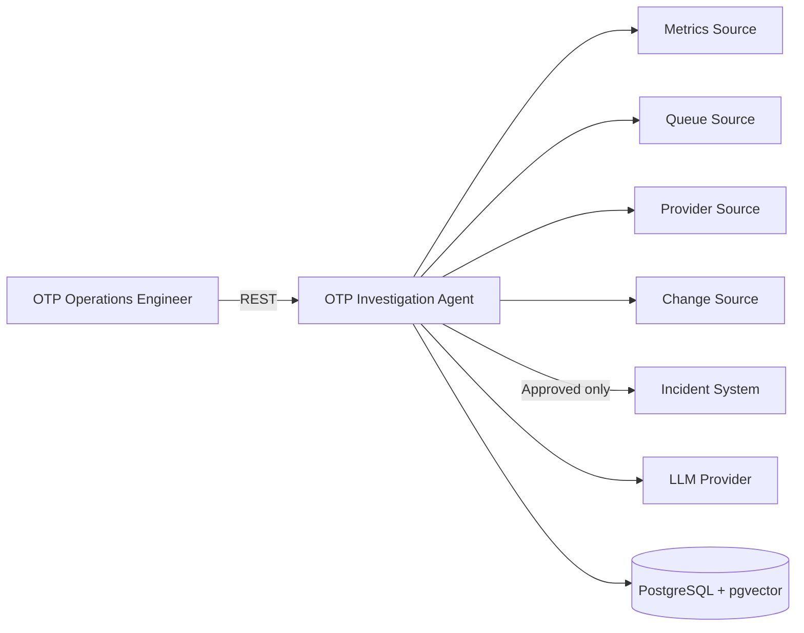

# OTP Incident Investigation Agent

Java tabanlı, kanıta dayalı OTP operasyon inceleme agent'ı için **spec-driven development** belge paketi.

## Amaç

Sistem, OTP teslimat performansındaki düşüşleri doğal dilde verilen bir operasyon sorusu üzerinden araştırır. Anlık operasyon verilerini tool calling ile toplar, geçmiş incident ve runbook belgelerini RAG ile getirir, kanıtlarla desteklenen hipotezler üretir ve kullanıcı onayıyla incident taslağı oluşturur.

Bu sistem bir metric dashboard veya tam otonom remediation ürünü değildir. Mevcut operasyon araçlarının üzerinde çalışan bir **araştırma ve karar destek katmanıdır**.

## Quickstart

```bash
cp .env.example .env
docker compose up --build
```

Wait for `db` health to report `healthy`, then check the app:

```bash
curl -s http://localhost:8080/actuator/health
# {"status":"UP"}
```

Swagger UI: http://localhost:8080/swagger-ui/index.html

The API walkthrough below requires `jq` and `uuidgen` (or `python3` as a
fallback for `uuidgen`) on the host.

If port `5432` is already used on the host, set `POSTGRES_PORT` in `.env` before
`docker compose up` (e.g. `POSTGRES_PORT=55432`) — the app's own DB connection
inside the compose network always uses `db:5432` internally, only the host
mapping changes.

## Bu bir mock/PoC'tur

Bu proje NETGSM'in (veya herhangi bir şirketin) iç mimarisini temsil etme
iddiası taşımaz. Tüm metrik, provider, kuyruk ve incident verisi
`docs/15-demo-fixtures.md`'deki sabit fixture'lardır — gerçek OTP gönderimi,
gerçek müşteri verisi veya gerçek provider entegrasyonu yoktur. Amaç, Java +
Spring Boot + LangChain4j ile tool calling / RAG / structured output /
human-in-the-loop onay akışını dar ve kanıtlanabilir bir problem üzerinde
göstermektir.

## Mimari



MVP dış sistemleri mock adapter'dır. Detaylı container/sequence diyagramları:
`docs/05-domain-and-architecture.md`.

## API walkthrough

```bash
# 1. Start an investigation
INV_ID=$(curl -s -X POST http://localhost:8080/api/v1/investigations \
  -H 'Content-Type: application/json' \
  -d '{
        "question": "Son 15 dakikada OTP teslimat oranı neden düştü?",
        "timeWindow": {"startAt": "2026-07-30T11:15:00Z", "endAt": "2026-07-30T11:30:00Z"},
        "locale": "tr-TR"
      }' | jq -r '.investigationId')
echo "$INV_ID"

# 2. Fetch the persisted result
curl -s http://localhost:8080/api/v1/investigations/$INV_ID | jq .

# 3. Preview the incident draft (no persistence yet)
curl -s -X POST http://localhost:8080/api/v1/investigations/$INV_ID/incident-draft/preview | jq .

# 4. Approve — creates the incident, idempotency key required
IDEMPOTENCY_KEY=$(uuidgen)
curl -s -X POST http://localhost:8080/api/v1/investigations/$INV_ID/incident-draft/decisions \
  -H 'Content-Type: application/json' \
  -H "Idempotency-Key: $IDEMPOTENCY_KEY" \
  -d '{"decision": "APPROVE", "reason": "Teknik ekip incelemesi için incident gerekli."}' | jq .

# 5. Replay with the same key — same incident, idempotentReplay=true
curl -s -X POST http://localhost:8080/api/v1/investigations/$INV_ID/incident-draft/decisions \
  -H 'Content-Type: application/json' \
  -H "Idempotency-Key: $IDEMPOTENCY_KEY" \
  -d '{"decision": "APPROVE", "reason": "Teknik ekip incelemesi için incident gerekli."}' | jq .
```

Or run `scripts/demo.sh` to execute all six steps in one command.

## Canlı demo nasıl çalıştırılır

Varsayılan mod (`AI_MODE=stub`) deterministik, sabit bir script kullanır — ağ
bağlantısı veya API key gerektirmez, CI'de ve `docker compose up`'ta hep
yeşildir. Canlı mod (`AI_MODE=live`) yerine gerçek NVIDIA NIM chat modeli
(`NVIDIA_CHAT_MODEL`) ile gerçek tool-calling yapar ve gerçek pgvector RAG'dan
(NVIDIA embedding modeliyle, `NVIDIA_EMBEDDING_MODEL`) sonuç döndürür — model
her seferinde biraz farklı ifade/sıra üretebilir (stub'un birebir sabit
script'inin aksine), ama aynı kanıt/hipotez/citation kurallarına uyar (bkz.
`docs/16-adr.md` ADR-015, `docs/07-agent-tool-spec.md`).

```bash
cp .env.example .env
# .env içinde:
#   AI_MODE=live
#   NVIDIA_API_KEY=<gerçek NVIDIA API key>
docker compose up --build
```

Uygulama açılışında (`AI_MODE=live` iken) `docs/15-demo-fixtures.md`'deki 4
knowledge fixture'ı (`INC-2026-041`, `RB-OTP-001`, `ERR-OTP-001`,
`POL-CHANGE-001`) otomatik olarak pgvector'a ingest edilir — elle bir adım
gerekmez. Bu ingest idempotenttir: konteyner her yeniden başladığında zaten var
olan belge/versiyon tekrar yazılmaz.

`NVIDIA_API_KEY` olmadan `AI_MODE=live` ile başlatmak, açılışta (startup'ta,
knowledge doküman auto-ingest adımında) hata verir — ilk API isteğini
beklemeden konteyner ayağa kalkmadan başarısız olur. Ana test suite ve
varsayılan demo akışı hep `AI_MODE=stub` ile çalışır ve gerçek bir key
gerektirmez.

## Bilinen sınırlamalar

- Stub model modu (`AI_MODE=stub`, varsayılan) tek bir sabit script'e bağlıdır
  (`OtpDropOneOhOneScript`); `DEMO_FIXTURE` sadece tool fixture verisini
  değiştirir, stub script'i değiştirmez. Bu nedenle `OTP-PARTIAL-001` /
  `OTP-INJECTION-001` gibi negatif fixture'lar stub modunda uçtan uca
  gösterilemez (yalnızca `AI_MODE=live` ile gerçek bir modelle). M8 kapsamı
  yeni script eklemeyi kapsamıyor.
- CORS varsayılan olarak kapalıdır (frontend aynı origin'den servis edilir,
  bkz. `docs/16-adr.md` ADR-016). Yalnızca `SPRING_PROFILES_ACTIVE=dev` ile
  (M10 frontend geliştirme sırasında, ayrı port Vite dev server için) dar bir
  CORS izni açılır.
- `422 QUESTION_NOT_ACTIONABLE` / `429 INVESTIGATION_RATE_LIMITED` stub-only
  MVP path'te gerçekçi bir tetikleyicisi olmadığı için test edilmemiştir
  (M7-report'ta not düşülmüş, bilinçli boşluk).
- Sistemde hiçbir yerde authentication/authorization yoktur — bu, yeni
  eklenen Swagger UI/OpenAPI endpoint'leri (`/swagger-ui/**`, `/v3/api-docs`)
  dahil tüm REST API'yi kapsar. PoC kapsamı için kabul edilebilir bir
  boşluktur, ancak bilerek ve proaktif olarak burada belirtilmiştir.

## Sabit teknoloji tabanı

- Java 21
- Spring Boot
- LangChain4j
- PostgreSQL + pgvector
- Maven
- Docker Compose
- JUnit 5
- Testcontainers
- Yapılandırılabilir LLM ve embedding sağlayıcısı

## MVP senaryosu

> Son 15 dakikada OTP başarı oranı yaklaşık %98'den %72'ye düştüğünde agent, sorunun Operatör B gateway bağlantı havuzu veya provider yavaşlamasıyla ilişkili olabileceğini kanıtlarıyla araştırır.

## MVP dışı

- Gerçek OTP gönderimi
- Gerçek müşteri veya telefon verisi
- Otomatik rollback/restart/config değişikliği
- NETGSM'in iç mimarisini temsil etme iddiası
- Çoklu agent gösterisi
- Tam dashboard

## Belge haritası

| Belge | Amaç |
|---|---|
| `docs/00-project-charter.md` | Proje hedefi, kapsam ve başarı tanımı |
| `docs/01-product-vision.md` | Ürün vizyonu ve değer önerisi |
| `docs/02-prd.md` | Ürün gereksinimleri |
| `docs/03-system-requirements.md` | İşlevsel ve işlevsel olmayan gereksinimler |
| `docs/04-user-stories.md` | Kullanıcı hikâyeleri ve use case'ler |
| `docs/05-domain-and-architecture.md` | Domain modeli ve mimari |
| `docs/06-api-contracts.md` | REST API sözleşmeleri |
| `docs/07-agent-tool-spec.md` | Agent ve tool sözleşmeleri |
| `docs/08-rag-spec.md` | RAG tasarımı |
| `docs/09-security-governance.md` | Güvenlik ve AI yönetişimi |
| `docs/10-observability-slo.md` | Log, metric, trace ve SLO |
| `docs/11-acceptance-criteria.md` | Kabul kriterleri |
| `docs/12-atdd-gherkin.md` | ATDD/Gherkin senaryoları |
| `docs/13-test-strategy.md` | Test yaklaşımı |
| `docs/14-implementation-plan.md` | Uygulama planı ve backlog |
| `docs/15-demo-fixtures.md` | Ana demo verisi |
| `docs/16-adr.md` | Mimari karar kayıtları |
| `docs/17-traceability-risk-dod.md` | İzlenebilirlik, risk ve Definition of Done |
| `docs/18-demo-interview-guide.md` | Teknik görüşme sunum rehberi |
| `docs/19-technology-baseline.md` | Sürüm politikası ve resmî kaynaklar |
| `docs/20-git-workflow.md` | Branch stratejisi, commit convention, merge kuralı |

## Temel tasarım ilkesi

> LLM doğal dil yorumlama, araştırma planlama ve hipotez üretmede kullanılır. Yetki, idempotency, onay, veri doğrulama ve operasyonel aksiyonlar deterministik kod tarafından yönetilir.

## Geliştirme sırası

1. Ana fixture ve domain modelleri
2. Mock tool adapter'ları
3. PostgreSQL/pgvector ve RAG
4. LangChain4j tool calling
5. Structured output ve claim validation
6. Human-in-the-loop incident taslağı
7. ATDD ve Testcontainers
8. Docker, demo ve README
