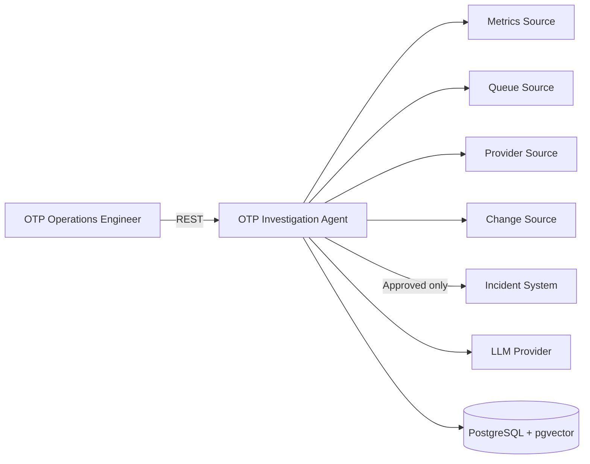
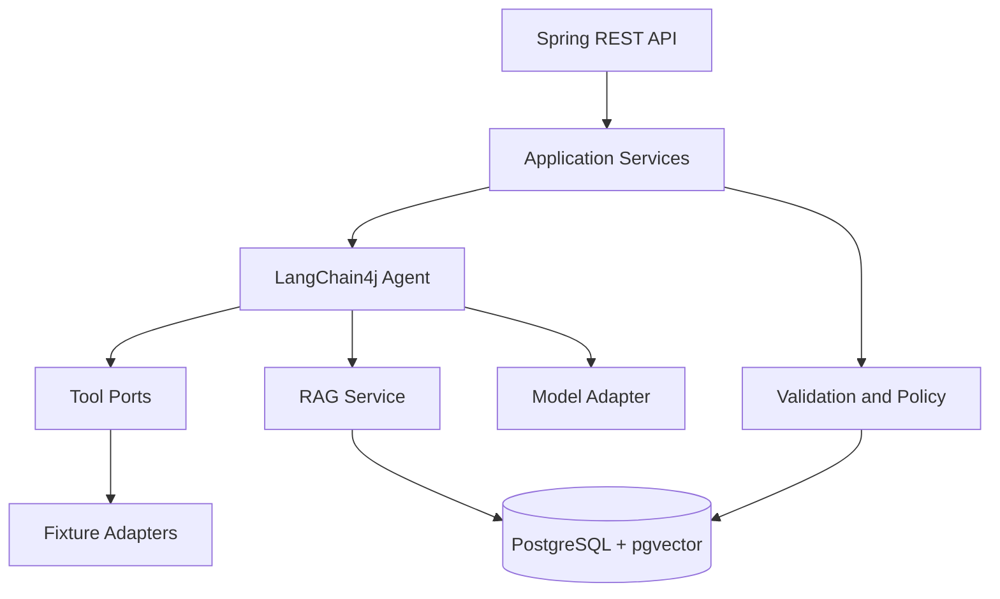
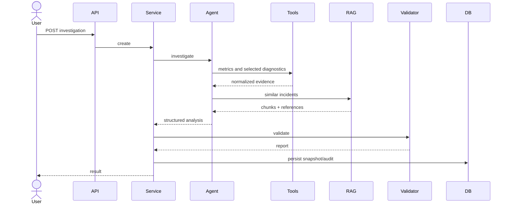
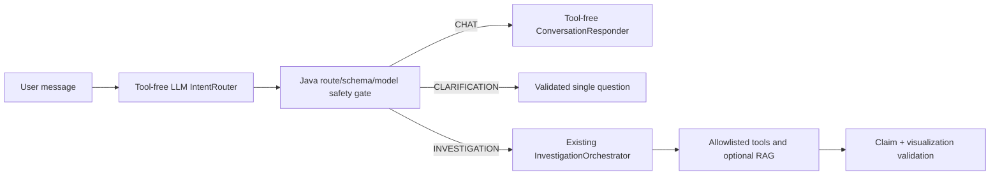

# 05 — Domain Model and Architecture

## Bounded context

`OTP Incident Investigation`

Metric platformu, provider sistemi, deployment kaynağı ve incident ürünü dış sistemdir.

## Aggregate'ler

### Investigation

Alanlar:

- InvestigationId
- Question
- ResolvedTimeWindow
- Status
- Severity
- Evidence
- Hypotheses
- RecommendedActions
- KnowledgeReferences
- Confidence
- ValidationReport
- ToolExecutions
- PromptVersion/SchemaVersion
- Visualizations

Yaşam döngüsü:

```text
RECEIVED
 -> COLLECTING_EVIDENCE
 -> GENERATING_ANALYSIS
 -> VALIDATING
 -> COMPLETED

Hata: PARTIAL veya FAILED
```

### IncidentDraft

```text
PREVIEWED -> APPROVED -> CREATED
          -> REJECTED
```

Alanlar: investigationId, payload, approval, idempotencyKey, externalIncidentId.

## Value object'ler

### TimeWindow

- startAt < endAt
- minimum 1 dakika
- maksimum 24 saat

### Evidence

- id
- sourceType
- sourceReference
- observation
- observedAt
- metricName/value/unit (opsiyonel)

### Hypothesis

- rank
- possibleCause
- probability
- supportingEvidenceIds
- contradictingEvidenceIds
- verificationSteps

### RecommendedAction

- actionType
- description
- risk
- requiresApproval
- executionMode (`MANUAL_CHECK`, `DRAFT_ONLY`)

## Domain invariant'ları

1. Tamamlanmış analysis en az bir evidence içerir.
2. `ANOMALY_CONFIRMED` current ve previous metrik içerir.
3. Her hypothesis supporting evidence taşır.
4. En fazla üç hypothesis vardır.
5. Confidence 0–1 aralığındadır.
6. High-risk aksiyon otomatik değildir.
7. Approval olmadan incident yaratılamaz.
8. Aynı idempotency key tek incident üretir.
9. Tool'da olmayan sayı evidence olamaz.
10. Visualization point'i canonical numeric evidence olmadan oluşturulamaz.
11. CHAT ve CLARIFICATION investigation aggregate'i oluşturmaz.

## Mimari stil

**Modüler monolith + hexagonal boundaries**

Gerekçe:

- Demo için mikroservis yükü yok.
- Domain/AI/adapter sınırları gösterilebilir.
- Tek komutla çalışma kolaydır.
- Gerçek adaptörler sonra ayrılabilir.

## Context diagram



MVP dış sistemleri mock adapter'dır.

## Container view



## Paket yapısı

```text
com.example.otpsentinel
├── api
├── application
├── domain
├── agent
├── tools
├── rag
├── adapters
├── observability
└── config
```

## Agentic/deterministik sınır

### Agent

- intent anlama
- tool seçme
- kanıtları yorumlama
- hipotez üretme
- manuel kontrol önerme

### Deterministik kod

- time-window sınırı
- tool allowlist/budget
- schema validation
- evidence ID doğrulama
- forbidden action kontrolü
- auth/onay/idempotency
- audit ve PII redaction

## Investigation sequence



## M12.3 iki aşamalı conversation routing



Application kontratları `IntentRouter`, `ConversationResponder`, bounded semantic context ve
conversation orchestration'dır. LangChain4j adapter'ları application portlarını uygular. Router/chat
context'i ile investigation agent tool memory'si ayrı tutulur; yalnız doğrulanmış final investigation
özeti semantic context'e eklenir. Domain Spring, LangChain4j, HTTP ve database import etmez.

`VisualizationSpec` dar bir domain value object'tir: allowlisted type/unit, en fazla 4 series ve 40
point; her point application-minted evidence ID taşır. Model serbest renderer config'i üretemez.

## Resilience

- Tool timeout: 2 s
- Tool retry: 1 transient retry
- Model timeout: 20 s
- Total deadline: 30 s
- Schema repair: 1
- RAG down: partial
- Metrics down: failed
