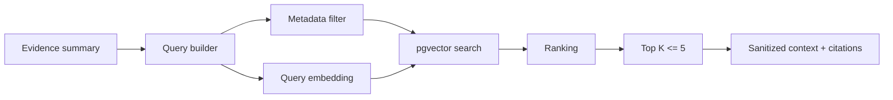

# 08 — RAG Specification

## Amaç

RAG anlık metrik sağlamaz. Şu kurumsal bilgiyi getirir:

- incident postmortem
- runbook
- error code reference
- provider playbook
- change policy

## MVP belge seti

1. `INC-2026-041` — provider timeout + connection pool leak
2. `RB-OTP-001` — OTP degradation runbook
3. `ERR-OTP-001` — error glossary
4. `POL-CHANGE-001` — rollback approval policy
5. Negatif/ilgisiz belge

## Metadata

```json
{
  "documentId": "INC-2026-041",
  "version": "1",
  "documentType": "INCIDENT_POSTMORTEM",
  "provider": "OPERATOR_B",
  "effectiveFrom": "2026-04-10",
  "effectiveTo": null,
  "language": "tr",
  "tags": ["otp", "timeout", "connection-pool", "gateway"]
}
```

## Chunking başlangıç hipotezi

- 500–800 token
- 80–120 token overlap
- section başlığı metadata'da
- tablolar bölünmez
- root cause ve resolution ayrı chunk olabilir

Bu değerler retrieval evaluation'a göre değiştirilebilir.

## Embedding kuralları

- Model adı/sürümü config ve metadata'da tutulur.
- Sorgu ve belge aynı modelle embed edilir.
- Model değişiminde yeniden ingestion yapılır.
- Embedding dimension migration ile uyumlu olmalıdır.

## Retrieval pipeline



## Enriched query örneği

```text
OTP delivery degradation
provider=OPERATOR_B
errors=PROVIDER_TIMEOUT,CONNECTION_RESET
queue=healthy
gateway_version=v2.4
connections=48/50
```

## Retrieval kuralları

- topK=5
- provider biliniyorsa filter
- expired runbook düşük sıralı
- similarity threshold config
- düşük score güçlü evidence değildir
- live evidence historical knowledge'dan önceliklidir

## Citation

Final result:

- documentId
- version
- title
- chunkId
- similarityScore

alanlarını taşır. Model source ID uyduramaz.

## Prompt injection koruması

Retrieved içerik “untrusted reference data” olarak çevrelenir. Belge içindeki talimatlar yürütülmez.

Ek kontroller:

- HTML/script temizleme
- size limit
- document-type allowlist
- instruction-pattern signal
- typed tool parameter validation

## Evaluation set

| Query | Beklenen |
|---|---|
| provider timeout connection pool | INC-2026-041 |
| OTP degradation runbook | RB-OTP-001 |
| PROVIDER_TIMEOUT meaning | ERR-OTP-001 |
| rollback approval | POL-CHANGE-001 |
| marketing campaign | İlgisiz incident yok |

Metrikler: Recall@5, MRR, citation completeness, expired document rate.

## Fallback

- RAG down: partial analysis
- No result: warning
- Low relevance: hypothesis evidence'a bağlanmaz
