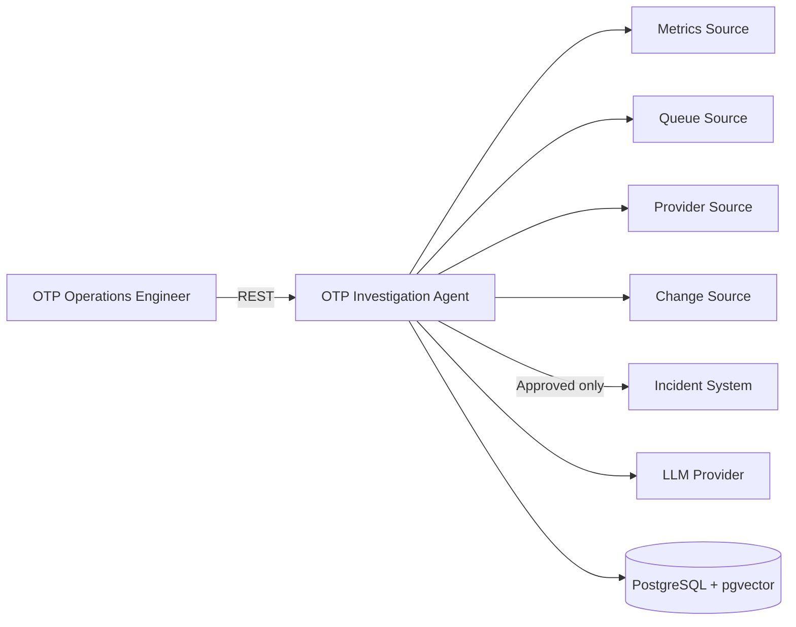

# M8 — Demo Readiness Implementation Plan

> **For agentic workers:** REQUIRED SUB-SKILL: Use superpowers:subagent-driven-development (recommended) or superpowers:executing-plans to implement this plan task-by-task. Steps use checkbox (`- [ ]`) syntax for tracking.

**Goal:** Make the already-functional OTP Incident Investigation Agent (M0-M7, 137/137 tests, main) presentable for a 5-7 minute technical demo/interview: quickstart, Swagger examples, a runnable demo script, clean logs, and a verified MVP release checklist — with no new domain behavior.

**Architecture:** No new endpoints, tools, or business rules. Work is additive documentation/config (README, springdoc-openapi, `scripts/demo.sh`) plus one narrow bugfix carried over from M7's final review (exception-type mislabeling). Every claim in the final report must be backed by an actually-executed command, not an assertion.

**Tech Stack:** Java 21, Spring Boot 3.3.5, LangChain4j 1.18.1, PostgreSQL+pgvector, Maven, Docker Compose, springdoc-openapi (new, this plan).

## Global Constraints

- Run all `mvn`, `docker` and `docker compose` commands from the repository root.
- Use Java 21 and Maven 3.9+. Testcontainers must be able to reach the active Docker Engine.
- Before every commit: `mvn spotless:apply` then full `mvn verify` green (per M8-prompt).
- No new domain rule, tool, or endpoint (M8-prompt: "yeni özellik eklemiyor"). The one exception is the narrow bugfix in Task 1, which is a correction to existing M7 behavior, not new behavior, and gets its own report per `prompts/05-bugfix.md`.
- New dependency (springdoc) requires the `docs/00-project-charter.md` scope-change justification (strengthens main scenario demo-ability, measurable via `/swagger-ui.html` reachability, doesn't touch the offline stub path, explainable in interview) — write this into the Task 2 commit body.
- Never commit `.env`, API keys, or the real NVIDIA key (`docs/09-security-governance.md`). `.env` is already gitignored — do not touch `.gitignore`.
- Conventional Commits per `docs/20-git-workflow.md`: `{type}({scope}): {summary}`, types `feat|fix|docs|test|chore|refactor`, no secrets in commit messages, no `--amend` on pushed commits.
- Do not claim a test passed or a command succeeded without pasting its actual output (`AGENTS.md`).
- Branch is already `milestone/M8-demo-readiness`, checked out from `main` at `f442d50`.

---

## Known repo facts implementers need (do not re-derive)

- `chatModel` bean in `src/main/java/com/example/otpsentinel/config/AgentConfig.java:34-43` is **hard-wired** to `OtpDropOneOhOneScript.build()` in stub mode regardless of `DEMO_FIXTURE`. Only the fixture *tool data* (`FixtureScenario`) varies with `DEMO_FIXTURE`; the scripted stub conversation does not. This means `DEMO_FIXTURE=OTP-PARTIAL-001` or `OTP-INJECTION-001` would NOT drive a coherent stub investigation today — wiring a second stub script is new feature scope, out of bounds for M8. The optional "failure demo" (M8-prompt item 4) is therefore **skipped by design**, not by oversight — record this in the M8 report.
- No `logging.*` config exists anywhere and no class in `src/main/java` calls `LoggerFactory`/`log.*` (verified by repo-wide grep) — there is currently nothing that logs a raw prompt, a secret, or a stack trace. `GlobalExceptionHandler` (`src/main/java/com/example/otpsentinel/api/GlobalExceptionHandler.java`) never echoes exception stack traces into the HTTP response, and `management.endpoint.health.show-details: never` in `application.yml` already hides internals from `/actuator/health`. Task 3 is a verification + explicit-config task, not a rewrite.
- `pom.xml` has no springdoc/swagger dependency today (verified by reading `pom.xml`). Task 2 adds it.
- `docs/17-traceability-risk-dod.md` MVP release checklist currently has these unchecked: `docker compose up --build`, `Health UP`, `README quickstart`, `5-7 dakika demo`, `Secret scan temiz`, `Mock olduğu açık`. Task 6 must tick each with real evidence.

---

### Task 1: Bugfix — stop mislabeling internal wiring errors as client 400s

**Files:**
- Modify: `src/main/java/com/example/otpsentinel/application/IncidentInvestigationService.java:198-206` (`requireMatchingRequest`)
- Modify: `src/main/java/com/example/otpsentinel/agent/ToolBudgetGuard.java:35-45` (constructor guards)
- Test: `src/test/java/com/example/otpsentinel/application/IncidentInvestigationServiceTest.java`
- Test: `src/test/java/com/example/otpsentinel/agent/ToolBudgetGuardTest.java`

**Interfaces:**
- Consumes: nothing new.
- Produces: `requireMatchingRequest` and `ToolBudgetGuard`'s constructor now throw `IllegalStateException` (not `IllegalArgumentException`) for these two internal-only invariant violations. `GlobalExceptionHandler`'s existing `@ExceptionHandler(IllegalArgumentException.class)` (`src/main/java/com/example/otpsentinel/api/GlobalExceptionHandler.java:38-42`) is untouched — it now correctly stops catching these two paths, which fall through to Spring's default 500 instead of a misleading `400 INVALID_REQUEST`.

**Root cause (per `prompts/05-bugfix.md`):** M7's final review parked a minor finding: the broad `IllegalArgumentException -> 400` handler was added to fix a real bug (malformed path UUID -> 500), but it also happens to catch two exceptions that can only be thrown by a broken deployment/wiring, never by a client request: `IncidentInvestigationService.requireMatchingRequest` (only reachable if `InvestigationOrchestrator` builds a mismatched `InvestigationRequest`/`Investigation` pair internally) and `ToolBudgetGuard`'s constructor guards (only reachable if `otp-sentinel.ai.max-tool-calls`/`otp-sentinel.tool.retry-count` config is misconfigured at startup). Both are server-side bugs that should surface as `5xx`, not be mislabeled as the caller's fault. The two dozen other `IllegalArgumentException` throw sites in the codebase (grep-verified) are either genuine per-request input validation (already correctly 400) or caught internally before reaching the controller (`IncidentInvestigationService.java:110`) — only these two are mislabeled. Fixing the type at the two throw sites (root cause) is a smaller, safer diff than adding new handler wiring.

- [ ] **Step 1: Write failing tests**

In `src/test/java/com/example/otpsentinel/application/IncidentInvestigationServiceTest.java`, add (matching the existing `investigate(TestContext context)` helper and `window()` helper already in this file):

```java
@Test
void mismatchedRequestIsAnInternalWiringBugNotAClientError() {
  IncidentInvestigationService service = new IncidentInvestigationService(1);
  TestContext context = /* reuse the same TestContext construction as the other investigate() tests in this file, e.g. successfulSingleToolCallContext() */;
  InvestigationRequest mismatched = new InvestigationRequest("a different question", window(), "v1", "v1");
  assertThatThrownBy(
          () ->
              service.investigate(
                  mismatched,
                  context.investigation(),
                  context.aiService(),
                  context.guard(),
                  context.collector()))
      .isInstanceOf(IllegalStateException.class)
      .isNotInstanceOf(IllegalArgumentException.class);
}
```

(Match whichever existing helper in this file builds a valid `TestContext` — read the file first and reuse it verbatim; do not invent a new one.)

In `src/test/java/com/example/otpsentinel/agent/ToolBudgetGuardTest.java`, add:

```java
@Test
void rejectsNonPositiveMaxCallsAsAnInternalConfigBug() {
  assertThatThrownBy(() -> new ToolBudgetGuard(0, Duration.ofSeconds(2), 1))
      .isInstanceOf(IllegalStateException.class)
      .isNotInstanceOf(IllegalArgumentException.class);
}

@Test
void rejectsNegativeRetryCountAsAnInternalConfigBug() {
  assertThatThrownBy(() -> new ToolBudgetGuard(1, Duration.ofSeconds(2), -1))
      .isInstanceOf(IllegalStateException.class)
      .isNotInstanceOf(IllegalArgumentException.class);
}
```

- [ ] **Step 2: Run tests, confirm they fail**

Run: `mvn -B -pl . test -Dtest=IncidentInvestigationServiceTest,ToolBudgetGuardTest`
Expected: the 3 new tests FAIL (`isInstanceOf(IllegalStateException.class)` fails because the actual type is `IllegalArgumentException`).

- [ ] **Step 3: Fix the two throw sites**

`src/main/java/com/example/otpsentinel/application/IncidentInvestigationService.java:198-206`:

```java
  private static void requireMatchingRequest(
      InvestigationRequest request, Investigation investigation) {
    if (!request.question().equals(investigation.question())
        || !request.resolvedTimeWindow().equals(investigation.resolvedTimeWindow())
        || !request.promptVersion().equals(investigation.promptVersion())
        || !request.schemaVersion().equals(investigation.schemaVersion())) {
      throw new IllegalStateException("request does not match investigation");
    }
  }
```

`src/main/java/com/example/otpsentinel/agent/ToolBudgetGuard.java:35-45`:

```java
  public ToolBudgetGuard(int maxCalls, Duration toolTimeout, int retryCount) {
    if (maxCalls <= 0) {
      throw new IllegalStateException("maxCalls must be positive");
    }
    this.maxCalls = maxCalls;
    this.toolTimeout = Objects.requireNonNull(toolTimeout, "toolTimeout must not be null");
    if (retryCount < 0) {
      throw new IllegalStateException("retryCount must not be negative");
    }
    this.retryCount = retryCount;
  }
```

- [ ] **Step 4: Run tests, confirm they pass**

Run: `mvn -B -pl . test -Dtest=IncidentInvestigationServiceTest,ToolBudgetGuardTest`
Expected: PASS, all tests including the 3 new ones.

- [ ] **Step 5: Full verify, then commit**

Run: `mvn -B spotless:apply verify`
Expected: BUILD SUCCESS, full suite green.

```bash
git add src/main/java/com/example/otpsentinel/application/IncidentInvestigationService.java \
        src/main/java/com/example/otpsentinel/agent/ToolBudgetGuard.java \
        src/test/java/com/example/otpsentinel/application/IncidentInvestigationServiceTest.java \
        src/test/java/com/example/otpsentinel/agent/ToolBudgetGuardTest.java
git commit -m "fix(agent): stop mislabeling internal wiring bugs as client 400s

requireMatchingRequest and ToolBudgetGuard's constructor guards can only be
triggered by a broken deployment (mismatched request/investigation pairing,
misconfigured tool-call/retry limits), never by a client request. They now
throw IllegalStateException so GlobalExceptionHandler's IllegalArgumentException
handler no longer mislabels them as 400 INVALID_REQUEST. Parked minor finding
from M7 final review (prompts/handoff/M7-report.md)."
```

Write a short bugfix note (per `prompts/05-bugfix.md`) as `prompts/handoff/M8-bugfix-exception-mislabeling.md`: symptom (M7-parked finding), root cause, fix, files changed, test evidence (paste actual `mvn test` output for the 3 new tests).

---

### Task 2: Swagger/OpenAPI examples

**Files:**
- Modify: `pom.xml`
- Modify: `src/main/resources/application.yml`
- Modify: `src/main/java/com/example/otpsentinel/api/InvestigationController.java`
- Modify: `src/main/java/com/example/otpsentinel/api/IncidentDraftController.java`
- Modify: `src/main/java/com/example/otpsentinel/api/dto/ProblemDetailsDto.java`

**Interfaces:**
- Consumes: existing controller methods/DTOs (Task 1 unrelated, no dependency).
- Produces: `/swagger-ui/index.html` and `/v3/api-docs` become reachable; request/response examples on the four documented endpoints match `docs/06-api-contracts.md` verbatim.

**Dependency justification (write into the commit body verbatim):** springdoc-openapi is a new dependency. Per `docs/00-project-charter.md` scope-change filter: it strengthens the main demo scenario (interviewer drives the API from a browser instead of memorizing curl), is measurable (`/swagger-ui/index.html` returns 200), does not touch the offline stub investigation path (pure annotation layer over existing controllers), and is explainable in a technical interview ("Spring's de-facto OpenAPI 3 generator, springdoc, not hand-rolled").

- [ ] **Step 1: Add the dependency**

In `pom.xml`, inside `<dependencies>` (after `spring-boot-starter-validation`):

```xml
        <dependency>
            <groupId>org.springdoc</groupId>
            <artifactId>springdoc-openapi-starter-webmvc-ui</artifactId>
            <version>2.6.0</version>
        </dependency>
```

- [ ] **Step 2: Verify the app still boots and Swagger is reachable**

Run: `mvn -B verify`
Expected: BUILD SUCCESS (no dependency conflict with the LangChain4j/Spring Boot BOMs).

Then (after Task 6's compose environment is up, or bring it up locally for this check): `curl -s -o /dev/null -w "%{http_code}" http://localhost:8080/v3/api-docs` — expect `200`.

- [ ] **Step 3: Add example-rich OpenAPI annotations to the two controllers**

`InvestigationController.java` — add imports and annotate `create`/`get`:

```java
import io.swagger.v3.oas.annotations.Operation;
import io.swagger.v3.oas.annotations.media.Content;
import io.swagger.v3.oas.annotations.media.ExampleObject;
import io.swagger.v3.oas.annotations.responses.ApiResponse;
import io.swagger.v3.oas.annotations.tags.Tag;
```

```java
@RestController
@RequestMapping("/api/v1/investigations")
@Tag(name = "Investigations", description = "Evidence-backed OTP incident investigation (mock/PoC — see README)")
public class InvestigationController {
  ...
  @PostMapping
  @Operation(
      summary = "Start an evidence-backed investigation",
      description = "Collects OTP metrics/errors/queue/provider/change evidence via tool calling, "
          + "retrieves similar past incidents via RAG, and returns a structured, validated analysis.")
  @ApiResponse(
      responseCode = "200",
      content = @Content(examples = @ExampleObject(name = "OTP-DROP-001", value = """
          {
            "question": "Son 15 dakikada OTP teslimat oranı neden düştü?",
            "timeWindow": {"startAt": "2026-07-30T11:15:00Z", "endAt": "2026-07-30T11:30:00Z"},
            "locale": "tr-TR"
          }""")))
  public ResponseEntity<InvestigationResponseDto> create(
      @RequestBody InvestigationRequestDto request, HttpServletRequest httpRequest) {
```

(Same pattern for `get`, and for `preview`/`decide` in `IncidentDraftController.java`, using the exact JSON bodies already shown in `docs/06-api-contracts.md` lines 16-25, 119-128, 140-145, 160-167 — copy them verbatim into `@ExampleObject(value = """ ... """)` blocks. Do not invent new example values.)

- [ ] **Step 4: Add `@Schema` examples to `ProblemDetailsDto`**

```java
package com.example.otpsentinel.api.dto;

import io.swagger.v3.oas.annotations.media.Schema;

public record ProblemDetailsDto(
    @Schema(example = "https://errors.example.local/investigation-timeout") String type,
    @Schema(example = "Investigation timed out") String title,
    @Schema(example = "504") int status,
    @Schema(example = "The investigation exceeded the configured deadline.") String detail,
    @Schema(example = "/api/v1/investigations") String instance,
    @Schema(example = "corr-ec3c") String correlationId,
    @Schema(example = "INVESTIGATION_TIMEOUT") String errorCode) {}
```

(Read the actual current field list/order in `ProblemDetailsDto.java` before editing — preserve it exactly, only add `@Schema` per field.)

- [ ] **Step 5: mvn verify, then commit**

Run: `mvn -B spotless:apply verify`
Expected: BUILD SUCCESS.

```bash
git add pom.xml src/main/java/com/example/otpsentinel/api/
git commit -m "docs(api): add springdoc-openapi with docs/06-matched request/response examples

New dependency justified per docs/00-project-charter scope-change filter:
strengthens demo scenario, measurable via /v3/api-docs reachability, no
change to the offline stub path. Examples copied verbatim from
docs/06-api-contracts.md so Swagger UI matches the documented contract."
```

---

### Task 3: Logging cleanup and verification

**Files:**
- Modify: `src/main/resources/application.yml`
- Test: manual curl evidence pasted into the M8 report (no new automated test — this is a config+verification task, not new logic).

**Interfaces:**
- Consumes: nothing.
- Produces: explicit `logging.level.root: INFO` (and Spring/web at `INFO`) so the demo terminal never shows `DEBUG` SQL/HTTP noise; documented evidence that no stack trace or secret is ever emitted.

- [ ] **Step 1: Add explicit logging config**

In `src/main/resources/application.yml`, after the `management:` block:

```yaml
logging:
  level:
    root: INFO
    org.springframework: INFO
    org.springframework.web: INFO
```

- [ ] **Step 2: Grep-verify no logging of secrets/prompts exists**

Run: `grep -rn "log\.\|logger\.\|LoggerFactory" src/main/java` — expected: no output (already verified during planning; re-verify after Task 1/2 changes didn't add any).

- [ ] **Step 3: Verify a 500 response body carries no stack trace**

With the compose stack up (see Task 6), trigger a genuine 500 (e.g. malformed JSON body to `POST /api/v1/investigations`, or reuse whatever the test suite already proves triggers a 5xx) and confirm the response body has no `at com.example...` frames and `management.endpoint.health.show-details: never` keeps `/actuator/health` detail-free:

```bash
curl -s http://localhost:8080/actuator/health
```

Expected: `{"status":"UP"}` only, no `components` detail.

- [ ] **Step 4: Commit**

```bash
git add src/main/resources/application.yml
git commit -m "chore(observability): pin explicit INFO logging for demo cleanliness

No DEBUG/TRACE noise (SQL params, HTTP bodies) can leak onto the demo
screen. Verified no class logs a stack trace, secret, or raw prompt
(docs/18 'gösterilmemesi gerekenler')."
```

---

### Task 4: README rewrite

**Files:**
- Modify: `README.md`

**Interfaces:**
- Consumes: the mermaid diagrams already in `docs/05-domain-and-architecture.md` (context diagram, lines 109-129), the request/response examples in `docs/06-api-contracts.md`, the disclaimer language in `docs/18-demo-interview-guide.md` ("Gösterilmemesi gerekenler", "Bu gerçek bir kurum sistemi mi?" answer).
- Produces: a README any outside reader (or interviewer) can follow standalone to run and demo the system.

- [ ] **Step 1: Add a Quickstart section right after "Amaç"**

```markdown
## Quickstart

```bash
cp .env.example .env
docker compose up --build
```

Wait for `db` health to report `healthy`, then check the app:

```bash
curl -s http://localhost:8080/actuator/health
# {"status":"UP"}
```

Swagger UI: http://localhost:8080/swagger-ui/index.html

If port `5432` is already used on the host, set `POSTGRES_PORT` in `.env` before
`docker compose up` (e.g. `POSTGRES_PORT=55432`) — the app's own DB connection
inside the compose network always uses `db:5432` internally, only the host
mapping changes.
```

- [ ] **Step 2: Add a "Mock/PoC" disclaimer**

Directly under the Quickstart section:

```markdown
## Bu bir mock/PoC'tur

Bu proje herhangi bir kurumun iç mimarisini temsil etme iddiası taşımaz. Tüm
metrik, provider, kuyruk ve incident verisi
`docs/15-demo-fixtures.md`'deki sabit fixture'lardır — gerçek OTP gönderimi,
gerçek müşteri verisi veya gerçek provider entegrasyonu yoktur. Amaç, Java +
Spring Boot + LangChain4j ile tool calling / RAG / structured output /
human-in-the-loop onay akışını dar ve kanıtlanabilir bir problem üzerinde
göstermektir.
```

- [ ] **Step 3: Add an Architecture section**

```markdown
## Mimari



MVP dış sistemleri mock adapter'dır. Detaylı container/sequence diyagramları:
`docs/05-domain-and-architecture.md`.
```

- [ ] **Step 4: Add curl walkthrough matching `docs/06`**

```markdown
## API walkthrough

```bash
# 1. Start an investigation
INV_ID=$(curl -s -X POST http://localhost:8080/api/v1/investigations \
  -H 'Content-Type: application/json' \
  -d '{
        "question": "Son 15 dakikada OTP teslimat oranı neden düştü?",
        "timeWindow": {"startAt": "2026-07-30T11:15:00Z", "endAt": "2026-07-30T11:30:00Z"},
        "locale": "tr-TR"
      }' | jq -r '.investigationId')
echo "$INV_ID"

# 2. Fetch the persisted result
curl -s http://localhost:8080/api/v1/investigations/$INV_ID | jq .

# 3. Preview the incident draft (no persistence yet)
curl -s -X POST http://localhost:8080/api/v1/investigations/$INV_ID/incident-draft/preview | jq .

# 4. Approve — creates the incident, idempotency key required
IDEMPOTENCY_KEY=$(uuidgen)
curl -s -X POST http://localhost:8080/api/v1/investigations/$INV_ID/incident-draft/decisions \
  -H 'Content-Type: application/json' \
  -H "Idempotency-Key: $IDEMPOTENCY_KEY" \
  -d '{"decision": "APPROVE", "reason": "Teknik ekip incelemesi için incident gerekli."}' | jq .

# 5. Replay with the same key — same incident, idempotentReplay=true
curl -s -X POST http://localhost:8080/api/v1/investigations/$INV_ID/incident-draft/decisions \
  -H 'Content-Type: application/json' \
  -H "Idempotency-Key: $IDEMPOTENCY_KEY" \
  -d '{"decision": "APPROVE", "reason": "Teknik ekip incelemesi için incident gerekli."}' | jq .
```

Or run `scripts/demo.sh` (Task 5) to execute all five steps in one command.
```

- [ ] **Step 5: Add a "Bilinen sınırlamalar" section**

```markdown
## Bilinen sınırlamalar

- Stub model modu (`AI_MODE=stub`, varsayılan) tek bir sabit script'e bağlıdır
  (`OtpDropOneOhOneScript`); `DEMO_FIXTURE` sadece tool fixture verisini
  değiştirir, stub script'i değiştirmez. Bu nedenle `OTP-PARTIAL-001` /
  `OTP-INJECTION-001` gibi negatif fixture'lar stub modunda uçtan uca
  gösterilemez (yalnızca `AI_MODE=live` ile gerçek bir modelle). M8 kapsamı
  yeni script eklemeyi kapsamıyor.
- `422 QUESTION_NOT_ACTIONABLE` / `429 INVESTIGATION_RATE_LIMITED` stub-only
  MVP path'te gerçekçi bir tetikleyicisi olmadığı için test edilmemiştir
  (M7-report'ta not düşülmüş, bilinçli boşluk).
```

- [ ] **Step 6: Manually run every command in Steps 1 and 4 against a real `docker compose up --build`, confirm output matches**

(Blocked on Task 6's environment work — if Task 6 runs first, do this verification then; otherwise do it as part of this task and feed results forward.)

- [ ] **Step 7: Commit**

```bash
git add README.md
git commit -m "docs(readme): add quickstart, architecture diagram, curl walkthrough, mock disclaimer

Demo-readiness per docs/18-demo-interview-guide.md: makes the README
sufficient on its own to run and demo the system end to end."
```

---

### Task 5: Bugfix — stub investigation script is exhausted after one use per running app

**Files:**
- Modify: `src/main/java/com/example/otpsentinel/config/AgentConfig.java`
- Modify: `src/main/java/com/example/otpsentinel/config/InvestigationOrchestrator.java`
- Modify: `src/test/java/com/example/otpsentinel/config/InvestigationOrchestratorTest.java`
- Test: (new test in the same file proving a second investigation on the same orchestrator instance still succeeds)

**Interfaces:**
- Consumes: nothing new.
- Produces: `InvestigationOrchestrator` now takes a `java.util.function.Supplier<ChatModel> chatModelFactory` (replacing the plain `ChatModel chatModel` field) and calls `chatModelFactory.get()` once per `runInvestigation(...)` call, so each investigation gets a chat model with fresh internal state. `AgentConfig.chatModel(...)` becomes `AgentConfig.chatModelFactory(...)` returning `Supplier<ChatModel>` (stub mode: `() -> new StubChatModel(OtpDropOneOhOneScript.build())`; live mode: `() -> OpenAiChatModel.builder()...build()`).

**Root cause (per `prompts/05-bugfix.md`), discovered during Task 4's live verification:** `AgentConfig.chatModel(...)` (`src/main/java/com/example/otpsentinel/config/AgentConfig.java:33-43`) is a singleton Spring bean. In stub mode it returns one `StubChatModel` instance built once at app startup, wrapping a fixed `StubScript` with a **mutable `stepIndex` field** (`StubChatModel.java:24-25`) that only ever advances, never resets. `InvestigationOrchestrator` (a singleton `@Service`) receives that one `ChatModel` via constructor injection and reuses the *same instance* for every `runInvestigation(...)` call for the app's entire lifetime (`InvestigationOrchestrator.java:128-132`, `.chatModel(chatModel)` — the field, not a fresh instance). The first investigation against a running `docker compose` stack consumes the whole scripted conversation; every subsequent investigation on that same running container throws `IllegalStateException("StubScript exhausted after N steps")`, which `IncidentInvestigationService.callWithRepair` catches as a generic failure, so the investigation completes with status `FAILED` ("structured output invalid...") instead of the correct analysis — with no indication to the caller that this is an app-lifecycle issue rather than a real investigation failure.

This directly contradicts ADR-011's own stated reason for the deterministic stub ("CI, offline demo **ve tekrar üretilebilirlik**" — reproducibility) and is a real risk to M8's core acceptance criterion: a demo that must be re-runnable (rehearsal before the real session, or the interviewer asking to see it again) breaks silently on the second run against a long-lived container. It was invisible to the existing 140-test suite because every test either constructs its own fresh `StubChatModel` directly or runs in a short-lived Spring context that never serves two investigations. The root-cause fix is to stop sharing one mutable `ChatModel` instance across investigations — inject a factory instead of a shared instance, so each investigation gets its own, matching the existing per-investigation objects already used elsewhere in the same method (`ToolBudgetGuard`, `EvidenceCollector` are already constructed fresh per call in `runInvestigation`, `InvestigationOrchestrator.java:115-117` — the `ChatModel` is the one exception that isn't).

- [ ] **Step 1: Write the failing test**

In `src/test/java/com/example/otpsentinel/config/InvestigationOrchestratorTest.java`, read the existing test that constructs `InvestigationOrchestrator` (around line 30, passing `new StubChatModel(OtpDropOneOhOneScript.build())` positionally where `chatModel` is today) and add:

```java
@Test
void secondInvestigationOnTheSameOrchestratorInstanceStillSucceeds() {
  // Reuses whatever this file's existing helper builds for repositories/tools/etc. — read the
  // file first and reuse it verbatim, only the chatModel wiring changes (Supplier instead of instance).
  InvestigationOrchestrator orchestrator = /* same construction as the existing passing test in
      this file, but passing a Supplier<ChatModel> that returns a NEW StubChatModel each call:
      () -> new StubChatModel(OtpDropOneOhOneScript.build()) */;

  Investigation first =
      orchestrator.runInvestigation(
          "Son 15 dakikada OTP teslimat oranı neden düştü?", /* same window() helper as other tests */ window(), "corr-1");
  Investigation second =
      orchestrator.runInvestigation(
          "Son 15 dakikada OTP teslimat oranı neden düştü?", window(), "corr-2");

  assertThat(first.phase()).isEqualTo(InvestigationPhase.COMPLETED);
  assertThat(second.phase()).isEqualTo(InvestigationPhase.COMPLETED);
}
```

(Match the exact existing test's setup for repositories/tools — read the file first, do not invent new mocks/fakes; only change how the chat model is supplied.)

- [ ] **Step 2: Run the test, confirm it fails**

Run: `mvn -B -pl . test -Dtest=InvestigationOrchestratorTest`
Expected: compile error first (constructor signature doesn't accept a `Supplier` yet) — that's fine, it's the same "failing test" signal for a constructor-shape change. Note the compile failure in your report, then proceed to Step 3 (you can't get a runtime-red test until the signature changes too — that's expected for this kind of fix, unlike a pure logic bug).

- [ ] **Step 3: Change `InvestigationOrchestrator` to take a factory**

In `src/main/java/com/example/otpsentinel/config/InvestigationOrchestrator.java`:
- Add `import java.util.function.Supplier;`
- Change the field `private final ChatModel chatModel;` to `private final Supplier<ChatModel> chatModelFactory;`
- Change the constructor parameter `ChatModel chatModel,` to `Supplier<ChatModel> chatModelFactory,`
- Change `this.chatModel = chatModel;` to `this.chatModelFactory = chatModelFactory;`
- In `runInvestigation(...)`, right before the `AiServices.builder(...)` call, add `ChatModel chatModel = chatModelFactory.get();` and keep `.chatModel(chatModel)` using that local variable (so the rest of the method body is unchanged).

- [ ] **Step 4: Change `AgentConfig` to expose a factory bean**

In `src/main/java/com/example/otpsentinel/config/AgentConfig.java`:
- Add `import java.util.function.Supplier;`
- Rename the bean method `chatModel(...)` to `chatModelFactory(...)`, change its return type from `ChatModel` to `Supplier<ChatModel>`, and change its body from constructing/returning a `ChatModel` directly to returning a lambda that does the same construction:

```java
  @Bean
  public Supplier<ChatModel> chatModelFactory(
      @Value("${AI_MODE:stub}") String aiMode,
      @Value("${NVIDIA_BASE_URL:https://integrate.api.nvidia.com/v1}") String baseUrl,
      @Value("${NVIDIA_API_KEY:}") String apiKey,
      @Value("${NVIDIA_CHAT_MODEL:}") String modelId) {
    if ("live".equalsIgnoreCase(aiMode)) {
      return () ->
          OpenAiChatModel.builder().baseUrl(baseUrl).apiKey(apiKey).modelName(modelId).build();
    }
    return () -> new StubChatModel(OtpDropOneOhOneScript.build());
  }
```

- [ ] **Step 5: Run the test, confirm it passes**

Run: `mvn -B -pl . test -Dtest=InvestigationOrchestratorTest`
Expected: PASS, including the new `secondInvestigationOnTheSameOrchestratorInstanceStillSucceeds` test.

- [ ] **Step 6: Full verify, then a live re-check of the exact bug scenario**

Run: `mvn -B spotless:apply verify`
Expected: BUILD SUCCESS, 140+ tests (140 plus your 1 new test), all green.

Then, to prove the actual bug is gone end to end: `docker compose up --build -d`, wait for healthy, then run the investigation-creation curl (from README's API walkthrough) **twice** against the same running container and confirm BOTH return `"status":"ANOMALY_CONFIRMED"` (not `FAILED`/"structured output invalid"), then `docker compose down -v`. Paste both real responses into your report.

- [ ] **Step 7: Commit**

```bash
git add src/main/java/com/example/otpsentinel/config/AgentConfig.java \
        src/main/java/com/example/otpsentinel/config/InvestigationOrchestrator.java \
        src/test/java/com/example/otpsentinel/config/InvestigationOrchestratorTest.java
git commit -m "fix(agent): give each investigation its own ChatModel instance

AgentConfig's chatModel bean was a singleton StubChatModel wrapping a
mutable, monotonically-advancing script index, shared across every
investigation for the app's lifetime. The first investigation against a
running container consumed the whole script; every later one failed with
'structured output invalid' instead of a real analysis, contradicting
ADR-011's reproducibility rationale for the stub. InvestigationOrchestrator
now takes a Supplier<ChatModel> and resolves a fresh instance per
investigation, matching how ToolBudgetGuard/EvidenceCollector are already
constructed fresh per call in the same method. Found during M8 Task 4's
live docker-compose verification."
```

Write a short bugfix note (per `prompts/05-bugfix.md`) as `prompts/handoff/M8-bugfix-stub-script-exhaustion.md`: symptom (found how, during which task), root cause, fix, files changed, test evidence (paste the real `mvn test` output for the new test, AND the two real curl responses from Step 6 proving two consecutive investigations both succeed against one running container).

---

### Task 6: Demo script

**Files:**
- Create: `scripts/demo.sh`

**Interfaces:**
- Consumes: the running compose stack (`http://localhost:8080`), `jq`, `uuidgen`/`python3` (for a UUID fallback).
- Produces: a single script that runs the `docs/18` demo flow end to end and prints each step's response.

- [ ] **Step 1: Write the script**

```bash
#!/usr/bin/env bash
# Runs the OTP-DROP-001 demo flow (docs/18-demo-interview-guide.md "Demo akışı").
# Prereqs: `docker compose up --build` already running, `jq` installed.
set -euo pipefail

BASE_URL="${BASE_URL:-http://localhost:8080}"

step() { printf '\n=== %s ===\n' "$1"; }

step "1. Health check"
curl -sf "$BASE_URL/actuator/health"; echo

step "2. Start investigation: $(cat <<'Q'
Son 15 dakikada OTP teslimat oranı neden düştü?
Q
)"
RESPONSE=$(curl -sf -X POST "$BASE_URL/api/v1/investigations" \
  -H 'Content-Type: application/json' \
  -d '{
        "question": "Son 15 dakikada OTP teslimat oranı neden düştü?",
        "timeWindow": {"startAt": "2026-07-30T11:15:00Z", "endAt": "2026-07-30T11:30:00Z"},
        "locale": "tr-TR"
      }')
echo "$RESPONSE" | jq .
INV_ID=$(echo "$RESPONSE" | jq -r '.investigationId')

step "3. Fetch persisted result (GET, id=$INV_ID)"
curl -sf "$BASE_URL/api/v1/investigations/$INV_ID" | jq .

step "4. Preview incident draft (no persistence yet)"
curl -sf -X POST "$BASE_URL/api/v1/investigations/$INV_ID/incident-draft/preview" | jq .

step "5. Approve (creates the incident)"
IDEMPOTENCY_KEY=$(uuidgen 2>/dev/null || python3 -c 'import uuid;print(uuid.uuid4())')
curl -sf -X POST "$BASE_URL/api/v1/investigations/$INV_ID/incident-draft/decisions" \
  -H 'Content-Type: application/json' \
  -H "Idempotency-Key: $IDEMPOTENCY_KEY" \
  -d '{"decision": "APPROVE", "reason": "Teknik ekip incelemesi için incident gerekli."}' | jq .

step "6. Replay the SAME Idempotency-Key (expect idempotentReplay=true, same incident)"
curl -sf -X POST "$BASE_URL/api/v1/investigations/$INV_ID/incident-draft/decisions" \
  -H 'Content-Type: application/json' \
  -H "Idempotency-Key: $IDEMPOTENCY_KEY" \
  -d '{"decision": "APPROVE", "reason": "Teknik ekip incelemesi için incident gerekli."}' | jq .

printf '\nDemo complete.\n'
```

- [ ] **Step 2: Make it executable**

```bash
chmod +x scripts/demo.sh
```

- [ ] **Step 3: Run it against the real compose stack, capture actual output**

Run after `docker compose up --build -d` from Task 7:
`./scripts/demo.sh`
Expected: all 6 steps print real JSON; step 6's `idempotentReplay` is `true` and its `incidentDraftId` equals step 5's.

Paste the real output into the M8 report.

- [ ] **Step 4: Commit**

```bash
git add scripts/demo.sh
git commit -m "chore(demo): add scripts/demo.sh for the OTP-DROP-001 end-to-end flow

Automates docs/18 'Demo akışı' steps 2-7 (investigation, tool-backed result,
preview, approve, idempotent replay) into one runnable script."
```

---

### Task 7: MVP release checklist verification (run last, before the report)

**Files:**
- Modify: `docs/17-traceability-risk-dod.md` (tick boxes with real evidence, do not just check them)

**Interfaces:**
- Consumes: everything from Tasks 1-6 merged into the branch.
- Produces: every line of the MVP release checklist actually run once and ticked, or explicitly left unticked with a documented reason.

- [ ] **Step 1: Full clean build**

Run: `mvn -B spotless:apply verify`
Record: BUILD SUCCESS, test counts (unit + integration + ATDD), in the report.

- [ ] **Step 2: Clean-environment compose up**

Run: `docker compose down -v && docker compose up --build -d`
Then poll: `docker compose ps` until `db` shows `healthy` and `app` is `Up`.
Verify: `curl -s http://localhost:8080/actuator/health` returns `{"status":"UP"}`.
If port 5432 is occupied on the host, set `POSTGRES_PORT` in `.env` and retry — record which happened.

- [ ] **Step 3: Run `scripts/demo.sh`, time it**

Run: `time ./scripts/demo.sh`
Record: wall time (must support a 5-7 minute *narrated* demo — the script itself should run in well under a minute; the 5-7 minutes is presenter narration time per `docs/18`).

- [ ] **Step 4: Secret scan**

Run: `git log -p milestone/M8-demo-readiness ^main | grep -i -E "nvapi-|api[_-]?key.*=|password.*=" || echo "clean"`
and
`grep -rn "nvapi-" . --include=*.md --include=*.yml --include=*.java --include=*.env* 2>/dev/null | grep -v node_modules || echo "clean"`
Record actual output. Confirm `.env` (with the real key) is not tracked: `git ls-files .env` must print nothing.

- [ ] **Step 5: README quickstart, verbatim**

Re-run every command from README Quickstart + API walkthrough (Task 4) against the environment from Step 2, confirm they work exactly as documented (no undocumented extra flags needed).

- [ ] **Step 6: Tick the checklist in `docs/17-traceability-risk-dod.md`**

Change:
```markdown
- [ ] `docker compose up --build`
- [ ] Health UP
...
- [ ] README quickstart
- [ ] 5–7 dakika demo
- [ ] Secret scan temiz
- [ ] Mock olduğu açık
```
to `- [x]` for each item actually verified in Steps 1-5, with a one-line evidence note appended to the file under a new `### M8 status` heading (mirroring the existing `### M7 status` section), e.g.:

```markdown
### M8 status

- `docker compose up --build` verified clean (`docker compose down -v && up --build`): `db` healthy, `app` Up, `GET /actuator/health` -> `{"status":"UP"}`.
- `scripts/demo.sh` run end to end: investigation created, preview generated, approved (incidentDraftId=..., externalIncidentId=DEMO-INC-...), replayed with the same Idempotency-Key -> idempotentReplay=true, same incidentDraftId.
- Secret scan: `git log -p` and repo grep for `nvapi-`/`api_key=` clean; `.env` untracked.
- Mock/PoC disclaimer present in README ("Bu bir mock/PoC'tur").
- 5-7 minute demo: scripted flow runs in <1 min; narration per docs/18 fills the remaining time (not separately re-timed with a human narrator in this session).
```

Any item that could NOT be verified stays unticked with an explicit reason (do not tick without evidence — `AGENTS.md`).

- [ ] **Step 7: Commit**

```bash
git add docs/17-traceability-risk-dod.md
git commit -m "docs(dod): verify and tick MVP release checklist with real evidence

Ran full mvn verify, clean docker compose up --build, scripts/demo.sh,
secret scan, and README quickstart against a live environment; recorded
actual results under docs/17 'M8 status'."
```

---

## Final steps (done directly in this session, not a subagent task)

1. Whole-branch review: read every diff on `milestone/M8-demo-readiness` against `main` in one pass (like the M7 final review that found 1 Critical + 4 Important — do not skip this per M8-prompt explicit instruction).
2. Write `prompts/handoff/M8-report.md` per `prompts/08-session-report.md` template — status `DONE` (never self-mark `VERIFIED`), real pasted command output for every test/build claim, explicit list of what was skipped (optional UI, optional failure demo) and why.
3. Append one line to `SESSION_LOG.md`.
4. Do not merge to `main` — a separate verification session does that per `docs/20-git-workflow.md`.

## Self-review notes

- Spec coverage: README/quickstart/curl (Task 4+5), Swagger examples (Task 2), seed/demo script (Task 5), architecture diagram (Task 4), clean logs (Task 3), MVP checklist (Task 6), failure demo and optional UI explicitly addressed as documented skips (not silently dropped) per M8-prompt's own "opsiyonel... atlandığını raporla" instruction.
- The M7-parked minor finding is the only in-scope "bug fix"; no other behavior changes anywhere in this plan.
- Task ordering: 1-3 are independent of each other and of Task 4/5's content but Task 4 Step 6 and Task 6 both need a live compose environment — Task 6 is the authoritative, final, from-clean verification pass; Task 4's in-task check can reuse whatever environment is already up rather than standing up compose twice.
